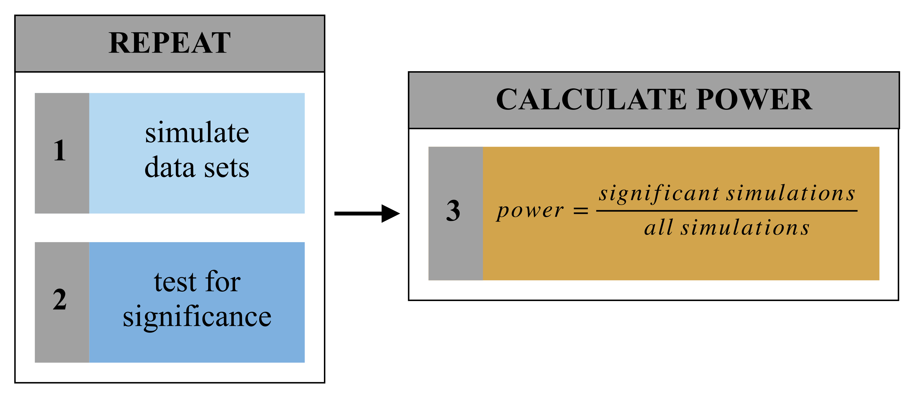

# Simulation

## Customization

Formulas often do not exist to calculate power for the effect of interest and therefore canned functions/programs/macros may not be available. For some studies, such as those involving complex study designs or those using mixed effects models for inference, we must therefore rely on simulation to provide a means of generating estimates of power that are customized for our current situation. 

The basic idea is to simulate running our study many times and calculate the proportion of times we reject the null hypothesis. This proportion provides an estimate of power. Generating a dataset and running an analysis for the hypothesis test is part of the simulation. Randomness is introduced into the process during dataset generation.

For example, say the desired power level is 90%, and you want to calculate the sample size required to obtain this level of power. We could use the "guess sample size and check power" method. Firstly, choose a sample size $n_1$ and run the simulation to estimate power. If power is estimated to be lower than 90%, select a new value $n_2$ that is larger than $n_1$ and run the simulation again. Simulation runs are repeated until the estimated power is roughly 90%.

## Step by step

There are two broad steps involved in conducting simulation-based power analysis: 1) thinking and, 2) implementing. 

- Think 
    1. **Model specification:** Write down the regression model, including all variables and parameters of interest.
    2. **Variable composition:** Specify the form of the explanatory variables, such as the range of age or BMI, proportion of females/males, or the coding scheme used for categorical terms.
    3. **Parameter composition:** Establish reasonable values for the data-generating parameters in your model.

- Implement  
    4. **Simulate:** Simulate the sampling process for a single dataset, assuming the alternative hypothesis, and fit the model of interest.
    5. **Automate:** Write a function/program/macro to automate the process of creating datasets, fitting models, testing the hypothesis of interest, and calculating power for that test - the number of significant simulations out of the total number of simulations. The function/program/macro should be flexible enough to allow for iterating power calculations over a grid of different parameter values.
    6. **Summarize:** Summarize the relationships between power, sample size, and effect size in tables and figures.

The implementation phase can be summarized by the following graphic:

