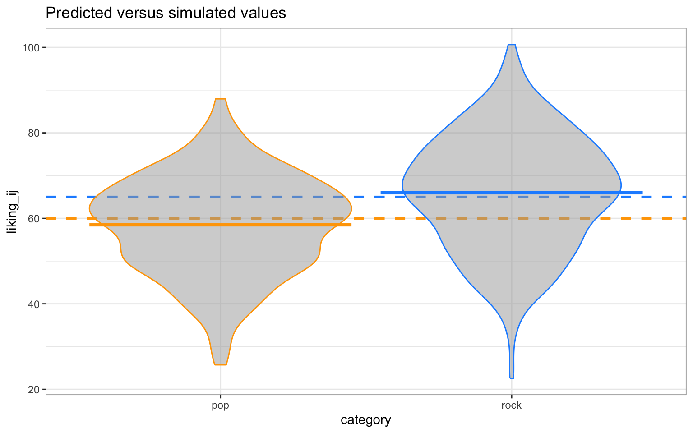

# (PART) Implementation {-}

# R 

## Setup

We will need to use several R packages to optimize our workflow and fit mixed effects models. We can use the `p_load()` function from the `{pacman}` library to automate installing these packages onto our machine and then load them into our search path. 


```r
# uncomment the line below to install the {pacman} library on your computer
# install.packages("pacman")

pacman::p_load(
  lme4,         # model specification / estimation
  lmerTest,     # provides p-values in the model output
  future,       # parallelization
  future.apply, # fast automation
  furrr,        # fast functional programming
  faux,         # simulate from multivariate normal distribution
  broom.mixed,  # extracting tidy data from model fits
  tidyverse,    # data wrangling and visualisation
  gt            # nice tables
  )

faux_options(verbose = FALSE)
```

We will also set the pseudo-random number generator seed to `02138` to make the stochastic components of our simulations reproducible. 


```r
set.seed(02138)
```

Finally, let's take advantage of background parallelization to speed-up iterative processes.


```r
plan(multisession)
```

## Data simulation step by step

To give an overview of the power simulation task, we will simulate data from a design with crossed random factors of subjects and songs (see [Power of What?](./power-of-what.html) for design details), fit a model to the simulated data, recover from the model output the parameter values we put in, calculate power, and finally automate the whole process so that we can calculate power for different effect sizes. Much of the general workflow here is borrowed from [DeBruine & Dale (2021) Understanding Mixed-Effects Models through Simulation](https://journals.sagepub.com/doi/full/10.1177/2515245920965119). We'll start by writing code that simulates datasets under the alternative hypothesis.

### Establish the simulation parameters

Before we start, let's set some global parameters for our power simulations. Since simulations can take a long time to run, we'll use 100 replications here as an example, but we recommend increasing this number to at least 1000 replications for a more accurate final power calculation.


```r
# number of simulation replicates for power calculation
reps <- 100

# specified alpha for power calculation
alpha <- 0.05
```

### Establish the data-generating parameters

The first thing to do is to set up the parameters that govern the process we assume gave rise to the data - the *data-generating process*, or DGP. We previously decided upon the the data-generating parameters (see [Power of What?](./power-of-what.html)), so we just need to code them here.


```r
# set all data-generating parameters
beta_0  <-  60   # intercept; i.e., the grand mean
beta_1  <-   5   # slope; i.e, effect of category
omega_0 <-   3   # by-song random intercept sd
tau_0   <-   7   # by-subject random intercept sd
tau_1   <-   4   # by-subject random slope sd
rho     <-   0.2 # correlation between intercept and slope
sigma   <-   8   # residual (error) sd
```

### Simulate the sampling process

Next, we will simulate the sampling process for the data. First, let's define parameters related to the number of observations. 


```r
# set number of subjects and songs
n_subj <-  25 # number of subjects
n_pop  <-  15 # number of songs in pop category
n_rock <-  15 # number of songs in rock category
```

#### Simulate the sampling of songs

We need to create a table listing each song $i$, which category it is in (`rock` or `pop`), and its random effect $O_{0i}$. The latter is sampled from a univariate normal distribution using the function `rnorm()`.


```r
# simulate a sample of songs
songs <- tibble(
  song_id = seq_len(n_pop + n_rock),
  category = rep(c("pop", "rock"), c(n_pop, n_rock)),
  genre_i = rep(c(0, 1), c(n_pop, n_rock)),
  O_0i = rnorm(n = n_pop + n_rock, mean = 0, sd = omega_0)
)

print(songs)
```

```
## # A tibble: 30 × 4
##    song_id category genre_i    O_0i
##      <int> <chr>      <dbl>   <dbl>
##  1       1 pop            0  0.0930
##  2       2 pop            0 -0.960 
##  3       3 pop            0 -2.40  
##  4       4 pop            0 -5.11  
##  5       5 pop            0  3.64  
##  6       6 pop            0  1.37  
##  7       7 pop            0 -8.10  
##  8       8 pop            0 -0.382 
##  9       9 pop            0 -3.41  
## 10      10 pop            0  5.14  
## # ℹ 20 more rows
```

#### Simulate the sampling of subjects

Now we simulate the sampling of participants, which results in table listing each individual and their two correlated random effects (a random intercept and random slope). To do this, we must sample ${T_{0j}, T_{1j}}$ pairs - one for each subject - from a bivariate normal distribution.

We will use the function `faux::rnorm_multi()`, which generates a table of `n` simulated values from a multivariate normal distribution by specifying the means (`mu`) and standard deviations (`sd`) of each variable, plus the correlations (`r`), which can be either a single value (applied to all pairs), a correlation matrix, or a vector of the values in the upper right triangle of the correlation matrix.


```r
# simulate a sample of subjects

# sample from a multivariate normal distribution
subjects <- faux::rnorm_multi(
    n = n_subj,
    mu = 0, # means for random effects are always 0
    sd = c(tau_0, tau_1), # set SDs
    r = rho, # set correlation
    varnames = c("T_0j", "T_1j")
  ) |>
  mutate(subj_id = seq_len(n_subj)) # add subject IDs

print(subjects)
```

```
##           T_0j       T_1j subj_id
## 1   -2.3346510  0.1687614       1
## 2    0.3959453  1.9622098       2
## 3   -8.4780483  0.7164860       3
## 4  -13.8131963 -5.0491497       4
## 5   -3.5060380 -1.1569376       5
## 6   -2.1212439 -4.9908990       6
## 7    9.4437300  6.9991910       7
## 8    3.9611598  3.0543689       8
## 9  -11.5109648 -3.2891498       9
## 10   4.7555765 -5.6778769      10
## 11 -14.1816592 -0.7967538      11
## 12   8.0029214  4.2205505      12
## 13  -1.5538324  4.4132587      13
## 14 -10.3679040  2.3872260      14
## 15  16.9451885  2.2781727      15
## 16   6.4422603  8.1231748      16
## 17   6.0274310  0.1527643      17
## 18   9.7576581  3.2542338      18
## 19  -2.3736184  4.0403367      19
## 20   7.3783324  4.8779376      20
## 21  -2.6966956 -4.2765738      21
## 22   4.5647259  2.4437034      22
## 23   2.4010082  8.6862440      23
## 24   1.7570425  1.3291182      24
## 25  -3.0887187 -2.7631663      25
```

#### Check the simulated values

Let's do a quick sanity check by comparing our simulated values to the parameters we used as inputs. Because the sampling process is stochastic, we shouldn't expect that these will exactly match for any given run of the simulation.


```r
tibble(
  parameter = c("omega_0", "tau_0", "tau_1", "rho"),
  value = c(omega_0, tau_0, tau_1, rho),
  simulated = c(
    sd(songs$O_0i),
    sd(subjects$T_0j),
    sd(subjects$T_1j),
    cor(subjects$T_0j, subjects$T_1j)
  )
)
```

```
## # A tibble: 4 × 3
##   parameter value simulated
##   <chr>     <dbl>     <dbl>
## 1 omega_0     3       3.00 
## 2 tau_0       7       7.87 
## 3 tau_1       4       4.05 
## 4 rho         0.2     0.495
```

#### Simulate trials

Since all subjects rate all songs (i.e., the design is fully crossed) we can set up a table of trials by including every possible combination of the rows in the `subjects` and `songs` tables. Each trial has random error associated with it, reflecting fluctuations in trial-by-trial ratings due to unkown factors. We simulate this by sampling values from a univariate normal distribution with a mean of 0 and a standard deviation of `sigma`.


```r
# cross subject and song IDs; add an error term
trials <- crossing(subjects, songs) |>
  mutate(e_ij = rnorm(n(), mean = 0, sd = sigma))

print(trials)
```

```
## # A tibble: 750 × 8
##     T_0j   T_1j subj_id song_id category genre_i    O_0i  e_ij
##    <dbl>  <dbl>   <int>   <int> <chr>      <dbl>   <dbl> <dbl>
##  1 -14.2 -0.797      11       1 pop            0  0.0930 -2.07
##  2 -14.2 -0.797      11       2 pop            0 -0.960   5.46
##  3 -14.2 -0.797      11       3 pop            0 -2.40    5.79
##  4 -14.2 -0.797      11       4 pop            0 -5.11   -2.02
##  5 -14.2 -0.797      11       5 pop            0  3.64   16.5 
##  6 -14.2 -0.797      11       6 pop            0  1.37    3.92
##  7 -14.2 -0.797      11       7 pop            0 -8.10   11.9 
##  8 -14.2 -0.797      11       8 pop            0 -0.382  -6.91
##  9 -14.2 -0.797      11       9 pop            0 -3.41   -6.68
## 10 -14.2 -0.797      11      10 pop            0  5.14   -2.11
## # ℹ 740 more rows
```

#### Calculate response values

With this resulting `trials` table, in combination with the constants `beta_0` and `beta_1`, we have the full set of values that we need to compute the response variable `liking_ij` according the linear model we defined previously (see [Power of What?](./power-of-what.html)).


```r
dat_sim <- trials |>
  mutate(liking_ij = beta_0 + T_0j + O_0i + (beta_1 + T_1j) * genre_i + e_ij) %>%
  select(subj_id, song_id, category, genre_i, liking_ij)

print(dat_sim)
```

```
## # A tibble: 750 × 5
##    subj_id song_id category genre_i liking_ij
##      <int>   <int> <chr>      <dbl>     <dbl>
##  1      11       1 pop            0      43.8
##  2      11       2 pop            0      50.3
##  3      11       3 pop            0      49.2
##  4      11       4 pop            0      38.7
##  5      11       5 pop            0      66.0
##  6      11       6 pop            0      51.1
##  7      11       7 pop            0      49.7
##  8      11       8 pop            0      38.5
##  9      11       9 pop            0      35.7
## 10      11      10 pop            0      48.8
## # ℹ 740 more rows
```

#### Plot the data

Let's visualize the distribution of the response variable for each of the two song genres and superimpose the simulated parameter estimates for the means of these two groups.


```r
dat_sim |>
ggplot(aes(category, liking_ij, color = category)) +
  # predicted means
  geom_hline(yintercept = (beta_0 + 0*beta_1), 
             color = "orange", linetype = "dashed", linewidth = 1) +
  geom_hline(yintercept = (beta_0 + 1*beta_1), 
             color = "dodgerblue", linetype = "dashed", linewidth = 1) +
  # actual data
  geom_violin(alpha = 0.5, show.legend = FALSE, fill = "grey65") +
  stat_summary(fun = mean, geom="crossbar", show.legend = FALSE) +
  scale_color_manual(values = c("orange", "dodgerblue")) +
  ggtitle("Predicted versus simulated values") +
  theme_bw()
```



### Analyze the simulated data

Now we can analyze our simulated data in a linear mixed effects model using the function `lmer()` from the `{lmerTest}` package (which is a wrapper around the `lmer()` function from the `{lme4}` package that additionally provides $p$-values). The model formula in `lmer()` maps onto how we calculated our `liking_ij` outcome variable above.


```r
form <- formula(liking_ij ~ 1 + genre_i + (1 | song_id) + (1 + genre_i | subj_id))
```

The terms in this R formula are as follows:

- `liking_ij` is the response.
- `1` is the intercept (`beta_0`), which is the mean of the response for the pop genre of songs (because we used dummy coding for the `genre_i` term).
- `genre_i` is the dummy coded variable identifying whether song $i$ belongs to the pop or rock genre.
- `(1 | song_id)` specifies a song-specific random intercept (`O_0i`).
- `(1 + genre_i | subj_id)` specifies a subject-specific random intercept (`T_0j`) plus the subject specific random slope of the genre category (`T_1j`).

Now we can estimate the model.


```r
# fit a linear mixed-effects model to data
mod_sim <- lmer(form, data = dat_sim)

summary(mod_sim, corr = FALSE)
```

```
## Linear mixed model fit by REML. t-tests use Satterthwaite's method [
## lmerModLmerTest]
## Formula: form
##    Data: dat_sim
## 
## REML criterion at convergence: 5392.5
## 
## Scaled residuals: 
##      Min       1Q   Median       3Q      Max 
## -3.00888 -0.66610  0.02982  0.64259  2.95212 
## 
## Random effects:
##  Groups   Name        Variance Std.Dev. Corr
##  song_id  (Intercept) 12.60    3.550        
##  subj_id  (Intercept) 57.18    7.562        
##           genre_i     22.98    4.793    0.45
##  Residual             62.81    7.926        
## Number of obs: 750, groups:  song_id, 30; subj_id, 25
## 
## Fixed effects:
##             Estimate Std. Error     df t value Pr(>|t|)    
## (Intercept)   58.474      1.815 37.775  32.216  < 2e-16 ***
## genre_i        7.501      1.713 40.857   4.379 8.09e-05 ***
## ---
## Signif. codes:  0 '***' 0.001 '**' 0.01 '*' 0.05 '.' 0.1 ' ' 1
```

We can use the `broom.mixed::tidy()` function to get a tidy table of the results. This will prove to be super useful later when we need to combine the output from hundreds of simulations to calculate power. We will added columns for `parameter` and `value`, so we can compare the estimate from the model to the parameters we used to simulate the data. 


```r
# get a tidy table of results
broom.mixed::tidy(mod_sim) |>
  mutate(across(is.numeric, round, 3)) |>
  mutate(
    parameter = c("beta_0", "beta_1", "omega_0", "tau_0", "rho", "tau_1", "sigma"),
    value = c(beta_0, beta_1, omega_0, tau_0, rho, tau_1, sigma),
  ) |>
  select(term, parameter, value, estimate) |>
  knitr::kable()
```


|term                     |parameter | value| estimate|
|:------------------------|:---------|-----:|--------:|
|(Intercept)              |beta_0    |  60.0|   58.474|
|genre_i                  |beta_1    |   5.0|    7.501|
|sd__(Intercept)          |omega_0   |   3.0|    3.550|
|sd__(Intercept)          |tau_0     |   7.0|    7.562|
|cor__(Intercept).genre_i |rho       |   0.2|    0.451|
|sd__genre_i              |tau_1     |   4.0|    4.793|
|sd__Observation          |sigma     |   8.0|    7.926|

## Data simulation automated

Now that we've tested the data generating code, we can put it into a function so that it's easy to run it repeatedly.


```r
# set up the custom data simulation function
sim_data <- function(
  n_subj     =  25,   # number of subjects
  n_pop      =  15,   # number of pop songs
  n_rock     =  15,   # number of rock songs
  beta_0     =  60,   # mean for pop genre
  beta_1     =   5,   # effect of genre
  omega_0    =   3,   # by-song random intercept sd
  tau_0      =   7,   # by-subject random intercept sd
  tau_1      =   4,   # by-subject random slope sd
  rho        =   0.2, # correlation between intercept and slope
  sigma      =   8    # residual (standard deviation)
  )
{
  # simulate a sample of songs
  songs <- tibble(
    song_id = seq_len(n_pop + n_rock),
    category = rep(c("pop", "rock"), c(n_pop, n_rock)),
    genre_i = rep(c(0, 1), c(n_pop, n_rock)),
    O_0i = rnorm(n = n_pop + n_rock, mean = 0, sd = omega_0)
  )

  # simulate a sample of subjects
  subjects <- faux::rnorm_multi(
    n = n_subj,
    mu = 0,
    sd = c(tau_0, tau_1),
    r = rho,
    varnames = c("T_0j", "T_1j")
  ) |>
  mutate(subj_id = seq_len(n_subj))

# cross subject and song IDs
crossing(subjects, songs) |>
  mutate(e_ij = rnorm(n(), mean = 0, sd = sigma),
         liking_ij = beta_0 + T_0j + O_0i + (beta_1 + T_1j) * genre_i + e_ij) |>
  select(subj_id, song_id, category, genre_i, liking_ij)
}
```

## Power calculation single run

We can wrap the data generating function and modeling code in a new function `single_run()` that returns a tidy table of the analysis results for a single simulation run. We'll suppress warnings and messages from the modeling fitting process, as these sometimes occur with simulation runs that generate extreme realized values for parameters.


```r
# set up the power function
single_run <- function(...) {
  # ... is a shortcut that forwards any additional arguments to sim_data()
  dat_sim <- sim_data(...)
  mod_sim <- suppressWarnings({ suppressMessages({ # suppress singularity messages
    lmerTest::lmer(liking_ij ~ 1 + genre_i + (1 | song_id) + (1 + genre_i | subj_id), data = dat_sim)
  })})
  broom.mixed::tidy(mod_sim)
}
```

Let's test that our new `single_run()` function performs as expected.


```r
# run one model with default parameters
single_run()
```

```
## # A tibble: 7 × 8
##   effect   group    term            estimate std.error statistic    df   p.value
##   <chr>    <chr>    <chr>              <dbl>     <dbl>     <dbl> <dbl>     <dbl>
## 1 fixed    <NA>     (Intercept)       60.9        1.89     32.2   34.6  2.26e-27
## 2 fixed    <NA>     genre_i            4.23       1.58      2.68  39.9  1.08e- 2
## 3 ran_pars song_id  sd__(Intercept)    3.27      NA        NA     NA   NA       
## 4 ran_pars subj_id  sd__(Intercept)    8.24      NA        NA     NA   NA       
## 5 ran_pars subj_id  cor__(Intercep…    0.678     NA        NA     NA   NA       
## 6 ran_pars subj_id  sd__genre_i        4.37      NA        NA     NA   NA       
## 7 ran_pars Residual sd__Observation    7.73      NA        NA     NA   NA
```


```r
# run one model with new parameters
single_run(n_pop = 10, n_rock = 50, beta_1 = 2)
```

```
## # A tibble: 7 × 8
##   effect   group    term            estimate std.error statistic    df   p.value
##   <chr>    <chr>    <chr>              <dbl>     <dbl>     <dbl> <dbl>     <dbl>
## 1 fixed    <NA>     (Intercept)       57.0        1.97    29.0    44.9  1.05e-30
## 2 fixed    <NA>     genre_i            1.54       1.76     0.873  57.3  3.86e- 1
## 3 ran_pars song_id  sd__(Intercept)    3.46      NA       NA      NA   NA       
## 4 ran_pars subj_id  sd__(Intercept)    7.77      NA       NA      NA   NA       
## 5 ran_pars subj_id  cor__(Intercep…    0.210     NA       NA      NA   NA       
## 6 ran_pars subj_id  sd__genre_i        5.85      NA       NA      NA   NA       
## 7 ran_pars Residual sd__Observation    7.92      NA       NA      NA   NA
```

## Power calculation automated

To get an accurate estimation of power, we need to run the simulation many times. Here we use the `future_map_dfr()` function to iterate over a sequence of integers denoting the replications we want to perform.


```r
sims <- future_map_dfr(1:reps, ~ single_run())
```

We can finally calculate power for our parameter of interest `beta_1`(denoted in the tidy model output table as the term `genre_i`) by filtering to keep only that term and the calculating the proportion of times the $p$-value is below the `alpha` (0.05) threshold.


```r
# calculate mean estimates and power for specified alpha
sims |>
  filter(term == "genre_i") |>
  group_by(term) |>
  summarise(
    mean_estimate = mean(estimate),
    mean_se = mean(std.error),
    power = mean(p.value < alpha),
    .groups = "drop"
  )
```

```
## # A tibble: 1 × 4
##   term    mean_estimate mean_se power
##   <chr>           <dbl>   <dbl> <dbl>
## 1 genre_i          5.01    1.46  0.93
```

### Check false positive rate

We can do a sanity check to see if our simulation is performing as expected by checking the false positive rate (Type I error rate). We set the effect of `genre_ij` (`beta_1`) to 0 to calculate the false positive rate, which is the probability of concluding there is an effect when there is no actual effect in the population.


```r
# run simulations and calculate the false positive rate
sims_fp <- future_map_dfr(1:reps, ~ single_run(beta_1 = 0))

# calculate mean estimates and power for specified alpha
sims_fp |>
  filter(term == "genre_i") |>
  summarise(power = mean(p.value < alpha))
```

```
## # A tibble: 1 × 1
##   power
##   <dbl>
## 1  0.06
```

Ideally, the false positive rate will be equal to `alpha`, which we set at 0.05. 

## Power for different effect sizes

In real life, we will not know the effect size of our quantity of interest and so we will need to repeatedly perform the power analysis over a range of different plausible effect sizes. Perhaps we might also want to calculate power as we vary other data-generating parameters, such as the number of pop and rock songs sampled and the number of subjects sampled. We can create a table that combines all combinations of the parameters we want to vary in a grid.


```r
# grid of paramater values of interest
pgrid <- crossing(
  n_subj = c(10, 25, 50),
  n_pop = c(10, 40),
  n_rock = c(10, 40),
  beta_1 = 1:5 
)
```

We can now wrap our `single_run()` function within a more general function `parameter_search()` that takes the grid of parameter values as input and uses the `future_pmap_dfr()` function to iterate over each row of parameter values in `pgrid` and feed them into `single_run()`.


```r
# fit the models over the parameters
parameter_search <- function(params = pgrid){
  future_pmap_dfr(
    .l = params, # iterate over the grid of parameter values
    .f = ~ single_run(
             n_subj = ..1, # plug each row of parameter values into single_run()
             n_pop  = ..2, 
             n_rock = ..3,
             beta_1 = ..4
             ),
    .options = furrr_options(seed = TRUE),
    .progress = TRUE
  )
}
```

If we call `parameter_search()` it will return a single replication of simulations for each combination of parameter values in `pgrid`.


```r
parameter_search()
```

```
## # A tibble: 420 × 8
##    effect   group    term           estimate std.error statistic    df   p.value
##    <chr>    <chr>    <chr>             <dbl>     <dbl>     <dbl> <dbl>     <dbl>
##  1 fixed    <NA>     (Intercept)      58.3        2.97    19.7    10.4  1.42e- 9
##  2 fixed    <NA>     genre_i          -0.383      1.98    -0.194  12.9  8.49e- 1
##  3 ran_pars song_id  sd__(Intercep…    2.62      NA       NA      NA   NA       
##  4 ran_pars subj_id  sd__(Intercep…    8.58      NA       NA      NA   NA       
##  5 ran_pars subj_id  cor__(Interce…   -0.708     NA       NA      NA   NA       
##  6 ran_pars subj_id  sd__genre_i       3.24      NA       NA      NA   NA       
##  7 ran_pars Residual sd__Observati…    8.62      NA       NA      NA   NA       
##  8 fixed    <NA>     (Intercept)      62.8        2.15    29.1    14.6  2.36e-14
##  9 fixed    <NA>     genre_i           1.75       2.13     0.820  16.8  4.24e- 1
## 10 ran_pars song_id  sd__(Intercep…    3.52      NA       NA      NA   NA       
## # ℹ 410 more rows
```

To run multiple replications of `parameter_search()`, we can use the `future_replicate()` function, which just repeatedly calls `parameter_search()` for the number of times specified by `reps`. Fair warning, this will take some time if you have set a high number of replications!


```r
# replicate the parameter grid to match the dimensions of the model outputs
pgrid_expand <- pgrid |> 
  slice(rep(1:n(), each = 7)) |> # replicate each row by 7 parameters
  map_df(rep.int, times = reps) # replicate the whole grid by number of reps

# replicate the parameter search many times
sims_params <- future_replicate(
    n = reps, 
    expr = parameter_search(), 
    simplify = FALSE
    ) |>
  imap( ~ mutate(.x, rep = .y, .before = "effect")) |> # include rep ID
  bind_rows() |> # combine into a single tibble
  mutate(pgrid_expand, .before = "effect") # add in the parameter grid values
```

Now, as before, we can calculate power. But this time we'll group by all of the parameters we manipulated in `pgrid`, so that we can get power estimates for all combinations of parameter values.


```r
sims_table <- sims_params |>
  filter(term == "genre_i") |>
  group_by(term, n_subj, n_pop, n_rock, beta_1) |>
  summarise(
    mean_estimate = mean(estimate),
    mean_se = mean(std.error),
    power = mean(p.value < alpha),
    .groups = "drop"
  )
```

Here's a graph that visualizes the output of the power simulation. 


```r
sims_table |>
  mutate(across(n_subj:beta_1, as.factor),
         n_pop = paste0("n_pop: ", n_pop),
         n_rock = paste0("n_rock: ", n_rock)) |>
  ggplot(aes(x = mean_estimate, y = power,
             group = n_subj, color = n_subj)) +
  geom_hline(yintercept = 0.8, linetype = "dashed", 
             color = "grey50", linewidth =  0.5) +
  geom_line() +
  geom_point(size = 2) +
  facet_grid(n_pop ~ n_rock) +
  ylim(0, 1) +
  labs(x = "Effect size (rock genre - pop genre)",
       y = "Power",
       title = "Power analysis via simulation",
       color = "Sample size") +
  theme_bw()
```


Here's a nicely formatted table that summarizes the output from the power simulation.


```r
sims_table |>
  gt() |>
  tab_header(title = "Power analysis via simulation") |>
  data_color(
    columns = power,
    fn = scales::col_numeric(
      palette = c("red", "green"),
      domain = c(0, 1)
      )
  )
```

```{=html}
<div id="peypicwoph" style="padding-left:0px;padding-right:0px;padding-top:10px;padding-bottom:10px;overflow-x:auto;overflow-y:auto;width:auto;height:auto;">
<style>#peypicwoph table {
  font-family: system-ui, 'Segoe UI', Roboto, Helvetica, Arial, sans-serif, 'Apple Color Emoji', 'Segoe UI Emoji', 'Segoe UI Symbol', 'Noto Color Emoji';
  -webkit-font-smoothing: antialiased;
  -moz-osx-font-smoothing: grayscale;
}

#peypicwoph thead, #peypicwoph tbody, #peypicwoph tfoot, #peypicwoph tr, #peypicwoph td, #peypicwoph th {
  border-style: none;
}

#peypicwoph p {
  margin: 0;
  padding: 0;
}

#peypicwoph .gt_table {
  display: table;
  border-collapse: collapse;
  line-height: normal;
  margin-left: auto;
  margin-right: auto;
  color: #333333;
  font-size: 16px;
  font-weight: normal;
  font-style: normal;
  background-color: #FFFFFF;
  width: auto;
  border-top-style: solid;
  border-top-width: 2px;
  border-top-color: #A8A8A8;
  border-right-style: none;
  border-right-width: 2px;
  border-right-color: #D3D3D3;
  border-bottom-style: solid;
  border-bottom-width: 2px;
  border-bottom-color: #A8A8A8;
  border-left-style: none;
  border-left-width: 2px;
  border-left-color: #D3D3D3;
}

#peypicwoph .gt_caption {
  padding-top: 4px;
  padding-bottom: 4px;
}

#peypicwoph .gt_title {
  color: #333333;
  font-size: 125%;
  font-weight: initial;
  padding-top: 4px;
  padding-bottom: 4px;
  padding-left: 5px;
  padding-right: 5px;
  border-bottom-color: #FFFFFF;
  border-bottom-width: 0;
}

#peypicwoph .gt_subtitle {
  color: #333333;
  font-size: 85%;
  font-weight: initial;
  padding-top: 3px;
  padding-bottom: 5px;
  padding-left: 5px;
  padding-right: 5px;
  border-top-color: #FFFFFF;
  border-top-width: 0;
}

#peypicwoph .gt_heading {
  background-color: #FFFFFF;
  text-align: center;
  border-bottom-color: #FFFFFF;
  border-left-style: none;
  border-left-width: 1px;
  border-left-color: #D3D3D3;
  border-right-style: none;
  border-right-width: 1px;
  border-right-color: #D3D3D3;
}

#peypicwoph .gt_bottom_border {
  border-bottom-style: solid;
  border-bottom-width: 2px;
  border-bottom-color: #D3D3D3;
}

#peypicwoph .gt_col_headings {
  border-top-style: solid;
  border-top-width: 2px;
  border-top-color: #D3D3D3;
  border-bottom-style: solid;
  border-bottom-width: 2px;
  border-bottom-color: #D3D3D3;
  border-left-style: none;
  border-left-width: 1px;
  border-left-color: #D3D3D3;
  border-right-style: none;
  border-right-width: 1px;
  border-right-color: #D3D3D3;
}

#peypicwoph .gt_col_heading {
  color: #333333;
  background-color: #FFFFFF;
  font-size: 100%;
  font-weight: normal;
  text-transform: inherit;
  border-left-style: none;
  border-left-width: 1px;
  border-left-color: #D3D3D3;
  border-right-style: none;
  border-right-width: 1px;
  border-right-color: #D3D3D3;
  vertical-align: bottom;
  padding-top: 5px;
  padding-bottom: 6px;
  padding-left: 5px;
  padding-right: 5px;
  overflow-x: hidden;
}

#peypicwoph .gt_column_spanner_outer {
  color: #333333;
  background-color: #FFFFFF;
  font-size: 100%;
  font-weight: normal;
  text-transform: inherit;
  padding-top: 0;
  padding-bottom: 0;
  padding-left: 4px;
  padding-right: 4px;
}

#peypicwoph .gt_column_spanner_outer:first-child {
  padding-left: 0;
}

#peypicwoph .gt_column_spanner_outer:last-child {
  padding-right: 0;
}

#peypicwoph .gt_column_spanner {
  border-bottom-style: solid;
  border-bottom-width: 2px;
  border-bottom-color: #D3D3D3;
  vertical-align: bottom;
  padding-top: 5px;
  padding-bottom: 5px;
  overflow-x: hidden;
  display: inline-block;
  width: 100%;
}

#peypicwoph .gt_spanner_row {
  border-bottom-style: hidden;
}

#peypicwoph .gt_group_heading {
  padding-top: 8px;
  padding-bottom: 8px;
  padding-left: 5px;
  padding-right: 5px;
  color: #333333;
  background-color: #FFFFFF;
  font-size: 100%;
  font-weight: initial;
  text-transform: inherit;
  border-top-style: solid;
  border-top-width: 2px;
  border-top-color: #D3D3D3;
  border-bottom-style: solid;
  border-bottom-width: 2px;
  border-bottom-color: #D3D3D3;
  border-left-style: none;
  border-left-width: 1px;
  border-left-color: #D3D3D3;
  border-right-style: none;
  border-right-width: 1px;
  border-right-color: #D3D3D3;
  vertical-align: middle;
  text-align: left;
}

#peypicwoph .gt_empty_group_heading {
  padding: 0.5px;
  color: #333333;
  background-color: #FFFFFF;
  font-size: 100%;
  font-weight: initial;
  border-top-style: solid;
  border-top-width: 2px;
  border-top-color: #D3D3D3;
  border-bottom-style: solid;
  border-bottom-width: 2px;
  border-bottom-color: #D3D3D3;
  vertical-align: middle;
}

#peypicwoph .gt_from_md > :first-child {
  margin-top: 0;
}

#peypicwoph .gt_from_md > :last-child {
  margin-bottom: 0;
}

#peypicwoph .gt_row {
  padding-top: 8px;
  padding-bottom: 8px;
  padding-left: 5px;
  padding-right: 5px;
  margin: 10px;
  border-top-style: solid;
  border-top-width: 1px;
  border-top-color: #D3D3D3;
  border-left-style: none;
  border-left-width: 1px;
  border-left-color: #D3D3D3;
  border-right-style: none;
  border-right-width: 1px;
  border-right-color: #D3D3D3;
  vertical-align: middle;
  overflow-x: hidden;
}

#peypicwoph .gt_stub {
  color: #333333;
  background-color: #FFFFFF;
  font-size: 100%;
  font-weight: initial;
  text-transform: inherit;
  border-right-style: solid;
  border-right-width: 2px;
  border-right-color: #D3D3D3;
  padding-left: 5px;
  padding-right: 5px;
}

#peypicwoph .gt_stub_row_group {
  color: #333333;
  background-color: #FFFFFF;
  font-size: 100%;
  font-weight: initial;
  text-transform: inherit;
  border-right-style: solid;
  border-right-width: 2px;
  border-right-color: #D3D3D3;
  padding-left: 5px;
  padding-right: 5px;
  vertical-align: top;
}

#peypicwoph .gt_row_group_first td {
  border-top-width: 2px;
}

#peypicwoph .gt_row_group_first th {
  border-top-width: 2px;
}

#peypicwoph .gt_summary_row {
  color: #333333;
  background-color: #FFFFFF;
  text-transform: inherit;
  padding-top: 8px;
  padding-bottom: 8px;
  padding-left: 5px;
  padding-right: 5px;
}

#peypicwoph .gt_first_summary_row {
  border-top-style: solid;
  border-top-color: #D3D3D3;
}

#peypicwoph .gt_first_summary_row.thick {
  border-top-width: 2px;
}

#peypicwoph .gt_last_summary_row {
  padding-top: 8px;
  padding-bottom: 8px;
  padding-left: 5px;
  padding-right: 5px;
  border-bottom-style: solid;
  border-bottom-width: 2px;
  border-bottom-color: #D3D3D3;
}

#peypicwoph .gt_grand_summary_row {
  color: #333333;
  background-color: #FFFFFF;
  text-transform: inherit;
  padding-top: 8px;
  padding-bottom: 8px;
  padding-left: 5px;
  padding-right: 5px;
}

#peypicwoph .gt_first_grand_summary_row {
  padding-top: 8px;
  padding-bottom: 8px;
  padding-left: 5px;
  padding-right: 5px;
  border-top-style: double;
  border-top-width: 6px;
  border-top-color: #D3D3D3;
}

#peypicwoph .gt_last_grand_summary_row_top {
  padding-top: 8px;
  padding-bottom: 8px;
  padding-left: 5px;
  padding-right: 5px;
  border-bottom-style: double;
  border-bottom-width: 6px;
  border-bottom-color: #D3D3D3;
}

#peypicwoph .gt_striped {
  background-color: rgba(128, 128, 128, 0.05);
}

#peypicwoph .gt_table_body {
  border-top-style: solid;
  border-top-width: 2px;
  border-top-color: #D3D3D3;
  border-bottom-style: solid;
  border-bottom-width: 2px;
  border-bottom-color: #D3D3D3;
}

#peypicwoph .gt_footnotes {
  color: #333333;
  background-color: #FFFFFF;
  border-bottom-style: none;
  border-bottom-width: 2px;
  border-bottom-color: #D3D3D3;
  border-left-style: none;
  border-left-width: 2px;
  border-left-color: #D3D3D3;
  border-right-style: none;
  border-right-width: 2px;
  border-right-color: #D3D3D3;
}

#peypicwoph .gt_footnote {
  margin: 0px;
  font-size: 90%;
  padding-top: 4px;
  padding-bottom: 4px;
  padding-left: 5px;
  padding-right: 5px;
}

#peypicwoph .gt_sourcenotes {
  color: #333333;
  background-color: #FFFFFF;
  border-bottom-style: none;
  border-bottom-width: 2px;
  border-bottom-color: #D3D3D3;
  border-left-style: none;
  border-left-width: 2px;
  border-left-color: #D3D3D3;
  border-right-style: none;
  border-right-width: 2px;
  border-right-color: #D3D3D3;
}

#peypicwoph .gt_sourcenote {
  font-size: 90%;
  padding-top: 4px;
  padding-bottom: 4px;
  padding-left: 5px;
  padding-right: 5px;
}

#peypicwoph .gt_left {
  text-align: left;
}

#peypicwoph .gt_center {
  text-align: center;
}

#peypicwoph .gt_right {
  text-align: right;
  font-variant-numeric: tabular-nums;
}

#peypicwoph .gt_font_normal {
  font-weight: normal;
}

#peypicwoph .gt_font_bold {
  font-weight: bold;
}

#peypicwoph .gt_font_italic {
  font-style: italic;
}

#peypicwoph .gt_super {
  font-size: 65%;
}

#peypicwoph .gt_footnote_marks {
  font-size: 75%;
  vertical-align: 0.4em;
  position: initial;
}

#peypicwoph .gt_asterisk {
  font-size: 100%;
  vertical-align: 0;
}

#peypicwoph .gt_indent_1 {
  text-indent: 5px;
}

#peypicwoph .gt_indent_2 {
  text-indent: 10px;
}

#peypicwoph .gt_indent_3 {
  text-indent: 15px;
}

#peypicwoph .gt_indent_4 {
  text-indent: 20px;
}

#peypicwoph .gt_indent_5 {
  text-indent: 25px;
}
</style>
<table class="gt_table" data-quarto-disable-processing="false" data-quarto-bootstrap="false">
  <thead>
    <tr class="gt_heading">
      <td colspan="8" class="gt_heading gt_title gt_font_normal gt_bottom_border" style>Power analysis via simulation</td>
    </tr>
    
    <tr class="gt_col_headings">
      <th class="gt_col_heading gt_columns_bottom_border gt_left" rowspan="1" colspan="1" scope="col" id="term">term</th>
      <th class="gt_col_heading gt_columns_bottom_border gt_right" rowspan="1" colspan="1" scope="col" id="n_subj">n_subj</th>
      <th class="gt_col_heading gt_columns_bottom_border gt_right" rowspan="1" colspan="1" scope="col" id="n_pop">n_pop</th>
      <th class="gt_col_heading gt_columns_bottom_border gt_right" rowspan="1" colspan="1" scope="col" id="n_rock">n_rock</th>
      <th class="gt_col_heading gt_columns_bottom_border gt_right" rowspan="1" colspan="1" scope="col" id="beta_1">beta_1</th>
      <th class="gt_col_heading gt_columns_bottom_border gt_right" rowspan="1" colspan="1" scope="col" id="mean_estimate">mean_estimate</th>
      <th class="gt_col_heading gt_columns_bottom_border gt_right" rowspan="1" colspan="1" scope="col" id="mean_se">mean_se</th>
      <th class="gt_col_heading gt_columns_bottom_border gt_right" rowspan="1" colspan="1" scope="col" id="power">power</th>
    </tr>
  </thead>
  <tbody class="gt_table_body">
    <tr><td headers="term" class="gt_row gt_left">genre_i</td>
<td headers="n_subj" class="gt_row gt_right">10</td>
<td headers="n_pop" class="gt_row gt_right">10</td>
<td headers="n_rock" class="gt_row gt_right">10</td>
<td headers="beta_1" class="gt_row gt_right">1</td>
<td headers="mean_estimate" class="gt_row gt_right">0.6821340</td>
<td headers="mean_se" class="gt_row gt_right">2.1433713</td>
<td headers="power" class="gt_row gt_right" style="background-color: #F84200; color: #FFFFFF;">0.08</td></tr>
    <tr><td headers="term" class="gt_row gt_left">genre_i</td>
<td headers="n_subj" class="gt_row gt_right">10</td>
<td headers="n_pop" class="gt_row gt_right">10</td>
<td headers="n_rock" class="gt_row gt_right">10</td>
<td headers="beta_1" class="gt_row gt_right">2</td>
<td headers="mean_estimate" class="gt_row gt_right">1.7274589</td>
<td headers="mean_se" class="gt_row gt_right">2.1428328</td>
<td headers="power" class="gt_row gt_right" style="background-color: #F45500; color: #FFFFFF;">0.13</td></tr>
    <tr><td headers="term" class="gt_row gt_left">genre_i</td>
<td headers="n_subj" class="gt_row gt_right">10</td>
<td headers="n_pop" class="gt_row gt_right">10</td>
<td headers="n_rock" class="gt_row gt_right">10</td>
<td headers="beta_1" class="gt_row gt_right">3</td>
<td headers="mean_estimate" class="gt_row gt_right">2.7482126</td>
<td headers="mean_se" class="gt_row gt_right">2.1406312</td>
<td headers="power" class="gt_row gt_right" style="background-color: #ED6A00; color: #FFFFFF;">0.20</td></tr>
    <tr><td headers="term" class="gt_row gt_left">genre_i</td>
<td headers="n_subj" class="gt_row gt_right">10</td>
<td headers="n_pop" class="gt_row gt_right">10</td>
<td headers="n_rock" class="gt_row gt_right">10</td>
<td headers="beta_1" class="gt_row gt_right">4</td>
<td headers="mean_estimate" class="gt_row gt_right">3.6963509</td>
<td headers="mean_se" class="gt_row gt_right">2.1395978</td>
<td headers="power" class="gt_row gt_right" style="background-color: #E38200; color: #FFFFFF;">0.30</td></tr>
    <tr><td headers="term" class="gt_row gt_left">genre_i</td>
<td headers="n_subj" class="gt_row gt_right">10</td>
<td headers="n_pop" class="gt_row gt_right">10</td>
<td headers="n_rock" class="gt_row gt_right">10</td>
<td headers="beta_1" class="gt_row gt_right">5</td>
<td headers="mean_estimate" class="gt_row gt_right">4.6922276</td>
<td headers="mean_se" class="gt_row gt_right">2.1399928</td>
<td headers="power" class="gt_row gt_right" style="background-color: #CCA700; color: #000000;">0.48</td></tr>
    <tr><td headers="term" class="gt_row gt_left">genre_i</td>
<td headers="n_subj" class="gt_row gt_right">10</td>
<td headers="n_pop" class="gt_row gt_right">10</td>
<td headers="n_rock" class="gt_row gt_right">40</td>
<td headers="beta_1" class="gt_row gt_right">1</td>
<td headers="mean_estimate" class="gt_row gt_right">0.7216763</td>
<td headers="mean_se" class="gt_row gt_right">1.8288706</td>
<td headers="power" class="gt_row gt_right" style="background-color: #FA3900; color: #FFFFFF;">0.06</td></tr>
    <tr><td headers="term" class="gt_row gt_left">genre_i</td>
<td headers="n_subj" class="gt_row gt_right">10</td>
<td headers="n_pop" class="gt_row gt_right">10</td>
<td headers="n_rock" class="gt_row gt_right">40</td>
<td headers="beta_1" class="gt_row gt_right">2</td>
<td headers="mean_estimate" class="gt_row gt_right">1.7059291</td>
<td headers="mean_se" class="gt_row gt_right">1.8322465</td>
<td headers="power" class="gt_row gt_right" style="background-color: #F55100; color: #FFFFFF;">0.12</td></tr>
    <tr><td headers="term" class="gt_row gt_left">genre_i</td>
<td headers="n_subj" class="gt_row gt_right">10</td>
<td headers="n_pop" class="gt_row gt_right">10</td>
<td headers="n_rock" class="gt_row gt_right">40</td>
<td headers="beta_1" class="gt_row gt_right">3</td>
<td headers="mean_estimate" class="gt_row gt_right">2.6756674</td>
<td headers="mean_se" class="gt_row gt_right">1.8421354</td>
<td headers="power" class="gt_row gt_right" style="background-color: #E57E00; color: #FFFFFF;">0.28</td></tr>
    <tr><td headers="term" class="gt_row gt_left">genre_i</td>
<td headers="n_subj" class="gt_row gt_right">10</td>
<td headers="n_pop" class="gt_row gt_right">10</td>
<td headers="n_rock" class="gt_row gt_right">40</td>
<td headers="beta_1" class="gt_row gt_right">4</td>
<td headers="mean_estimate" class="gt_row gt_right">3.7319609</td>
<td headers="mean_se" class="gt_row gt_right">1.8460860</td>
<td headers="power" class="gt_row gt_right" style="background-color: #CCA700; color: #000000;">0.48</td></tr>
    <tr><td headers="term" class="gt_row gt_left">genre_i</td>
<td headers="n_subj" class="gt_row gt_right">10</td>
<td headers="n_pop" class="gt_row gt_right">10</td>
<td headers="n_rock" class="gt_row gt_right">40</td>
<td headers="beta_1" class="gt_row gt_right">5</td>
<td headers="mean_estimate" class="gt_row gt_right">4.7424011</td>
<td headers="mean_se" class="gt_row gt_right">1.8396712</td>
<td headers="power" class="gt_row gt_right" style="background-color: #9FD200; color: #000000;">0.72</td></tr>
    <tr><td headers="term" class="gt_row gt_left">genre_i</td>
<td headers="n_subj" class="gt_row gt_right">10</td>
<td headers="n_pop" class="gt_row gt_right">40</td>
<td headers="n_rock" class="gt_row gt_right">10</td>
<td headers="beta_1" class="gt_row gt_right">1</td>
<td headers="mean_estimate" class="gt_row gt_right">0.8245941</td>
<td headers="mean_se" class="gt_row gt_right">1.8332649</td>
<td headers="power" class="gt_row gt_right" style="background-color: #FA3900; color: #FFFFFF;">0.06</td></tr>
    <tr><td headers="term" class="gt_row gt_left">genre_i</td>
<td headers="n_subj" class="gt_row gt_right">10</td>
<td headers="n_pop" class="gt_row gt_right">40</td>
<td headers="n_rock" class="gt_row gt_right">10</td>
<td headers="beta_1" class="gt_row gt_right">2</td>
<td headers="mean_estimate" class="gt_row gt_right">1.8476570</td>
<td headers="mean_se" class="gt_row gt_right">1.8308934</td>
<td headers="power" class="gt_row gt_right" style="background-color: #F35800; color: #FFFFFF;">0.14</td></tr>
    <tr><td headers="term" class="gt_row gt_left">genre_i</td>
<td headers="n_subj" class="gt_row gt_right">10</td>
<td headers="n_pop" class="gt_row gt_right">40</td>
<td headers="n_rock" class="gt_row gt_right">10</td>
<td headers="beta_1" class="gt_row gt_right">3</td>
<td headers="mean_estimate" class="gt_row gt_right">2.8841097</td>
<td headers="mean_se" class="gt_row gt_right">1.8234947</td>
<td headers="power" class="gt_row gt_right" style="background-color: #E57E00; color: #FFFFFF;">0.28</td></tr>
    <tr><td headers="term" class="gt_row gt_left">genre_i</td>
<td headers="n_subj" class="gt_row gt_right">10</td>
<td headers="n_pop" class="gt_row gt_right">40</td>
<td headers="n_rock" class="gt_row gt_right">10</td>
<td headers="beta_1" class="gt_row gt_right">4</td>
<td headers="mean_estimate" class="gt_row gt_right">3.9163802</td>
<td headers="mean_se" class="gt_row gt_right">1.8294477</td>
<td headers="power" class="gt_row gt_right" style="background-color: #C4B100; color: #000000;">0.53</td></tr>
    <tr><td headers="term" class="gt_row gt_left">genre_i</td>
<td headers="n_subj" class="gt_row gt_right">10</td>
<td headers="n_pop" class="gt_row gt_right">40</td>
<td headers="n_rock" class="gt_row gt_right">10</td>
<td headers="beta_1" class="gt_row gt_right">5</td>
<td headers="mean_estimate" class="gt_row gt_right">4.9206879</td>
<td headers="mean_se" class="gt_row gt_right">1.8285285</td>
<td headers="power" class="gt_row gt_right" style="background-color: #9FD200; color: #000000;">0.72</td></tr>
    <tr><td headers="term" class="gt_row gt_left">genre_i</td>
<td headers="n_subj" class="gt_row gt_right">10</td>
<td headers="n_pop" class="gt_row gt_right">40</td>
<td headers="n_rock" class="gt_row gt_right">40</td>
<td headers="beta_1" class="gt_row gt_right">1</td>
<td headers="mean_estimate" class="gt_row gt_right">1.1213453</td>
<td headers="mean_se" class="gt_row gt_right">1.4790172</td>
<td headers="power" class="gt_row gt_right" style="background-color: #F84200; color: #FFFFFF;">0.08</td></tr>
    <tr><td headers="term" class="gt_row gt_left">genre_i</td>
<td headers="n_subj" class="gt_row gt_right">10</td>
<td headers="n_pop" class="gt_row gt_right">40</td>
<td headers="n_rock" class="gt_row gt_right">40</td>
<td headers="beta_1" class="gt_row gt_right">2</td>
<td headers="mean_estimate" class="gt_row gt_right">2.1427686</td>
<td headers="mean_se" class="gt_row gt_right">1.4853951</td>
<td headers="power" class="gt_row gt_right" style="background-color: #E77900; color: #FFFFFF;">0.26</td></tr>
    <tr><td headers="term" class="gt_row gt_left">genre_i</td>
<td headers="n_subj" class="gt_row gt_right">10</td>
<td headers="n_pop" class="gt_row gt_right">40</td>
<td headers="n_rock" class="gt_row gt_right">40</td>
<td headers="beta_1" class="gt_row gt_right">3</td>
<td headers="mean_estimate" class="gt_row gt_right">3.1372541</td>
<td headers="mean_se" class="gt_row gt_right">1.4847795</td>
<td headers="power" class="gt_row gt_right" style="background-color: #CDA500; color: #000000;">0.47</td></tr>
    <tr><td headers="term" class="gt_row gt_left">genre_i</td>
<td headers="n_subj" class="gt_row gt_right">10</td>
<td headers="n_pop" class="gt_row gt_right">40</td>
<td headers="n_rock" class="gt_row gt_right">40</td>
<td headers="beta_1" class="gt_row gt_right">4</td>
<td headers="mean_estimate" class="gt_row gt_right">4.1692116</td>
<td headers="mean_se" class="gt_row gt_right">1.4875177</td>
<td headers="power" class="gt_row gt_right" style="background-color: #98D700; color: #000000;">0.75</td></tr>
    <tr><td headers="term" class="gt_row gt_left">genre_i</td>
<td headers="n_subj" class="gt_row gt_right">10</td>
<td headers="n_pop" class="gt_row gt_right">40</td>
<td headers="n_rock" class="gt_row gt_right">40</td>
<td headers="beta_1" class="gt_row gt_right">5</td>
<td headers="mean_estimate" class="gt_row gt_right">5.1915115</td>
<td headers="mean_se" class="gt_row gt_right">1.4906076</td>
<td headers="power" class="gt_row gt_right" style="background-color: #6EEC00; color: #000000;">0.88</td></tr>
    <tr><td headers="term" class="gt_row gt_left">genre_i</td>
<td headers="n_subj" class="gt_row gt_right">25</td>
<td headers="n_pop" class="gt_row gt_right">10</td>
<td headers="n_rock" class="gt_row gt_right">10</td>
<td headers="beta_1" class="gt_row gt_right">1</td>
<td headers="mean_estimate" class="gt_row gt_right">0.6206088</td>
<td headers="mean_se" class="gt_row gt_right">1.7168699</td>
<td headers="power" class="gt_row gt_right" style="background-color: #FB3300; color: #FFFFFF;">0.05</td></tr>
    <tr><td headers="term" class="gt_row gt_left">genre_i</td>
<td headers="n_subj" class="gt_row gt_right">25</td>
<td headers="n_pop" class="gt_row gt_right">10</td>
<td headers="n_rock" class="gt_row gt_right">10</td>
<td headers="beta_1" class="gt_row gt_right">2</td>
<td headers="mean_estimate" class="gt_row gt_right">1.6084364</td>
<td headers="mean_se" class="gt_row gt_right">1.7200867</td>
<td headers="power" class="gt_row gt_right" style="background-color: #F15E00; color: #FFFFFF;">0.16</td></tr>
    <tr><td headers="term" class="gt_row gt_left">genre_i</td>
<td headers="n_subj" class="gt_row gt_right">25</td>
<td headers="n_pop" class="gt_row gt_right">10</td>
<td headers="n_rock" class="gt_row gt_right">10</td>
<td headers="beta_1" class="gt_row gt_right">3</td>
<td headers="mean_estimate" class="gt_row gt_right">2.6187355</td>
<td headers="mean_se" class="gt_row gt_right">1.7234279</td>
<td headers="power" class="gt_row gt_right" style="background-color: #E08700; color: #FFFFFF;">0.32</td></tr>
    <tr><td headers="term" class="gt_row gt_left">genre_i</td>
<td headers="n_subj" class="gt_row gt_right">25</td>
<td headers="n_pop" class="gt_row gt_right">10</td>
<td headers="n_rock" class="gt_row gt_right">10</td>
<td headers="beta_1" class="gt_row gt_right">4</td>
<td headers="mean_estimate" class="gt_row gt_right">3.6035387</td>
<td headers="mean_se" class="gt_row gt_right">1.7198478</td>
<td headers="power" class="gt_row gt_right" style="background-color: #CDA500; color: #000000;">0.47</td></tr>
    <tr><td headers="term" class="gt_row gt_left">genre_i</td>
<td headers="n_subj" class="gt_row gt_right">25</td>
<td headers="n_pop" class="gt_row gt_right">10</td>
<td headers="n_rock" class="gt_row gt_right">10</td>
<td headers="beta_1" class="gt_row gt_right">5</td>
<td headers="mean_estimate" class="gt_row gt_right">4.5822773</td>
<td headers="mean_se" class="gt_row gt_right">1.7152229</td>
<td headers="power" class="gt_row gt_right" style="background-color: #98D700; color: #000000;">0.75</td></tr>
    <tr><td headers="term" class="gt_row gt_left">genre_i</td>
<td headers="n_subj" class="gt_row gt_right">25</td>
<td headers="n_pop" class="gt_row gt_right">10</td>
<td headers="n_rock" class="gt_row gt_right">40</td>
<td headers="beta_1" class="gt_row gt_right">1</td>
<td headers="mean_estimate" class="gt_row gt_right">0.9055907</td>
<td headers="mean_se" class="gt_row gt_right">1.4495982</td>
<td headers="power" class="gt_row gt_right" style="background-color: #F84200; color: #FFFFFF;">0.08</td></tr>
    <tr><td headers="term" class="gt_row gt_left">genre_i</td>
<td headers="n_subj" class="gt_row gt_right">25</td>
<td headers="n_pop" class="gt_row gt_right">10</td>
<td headers="n_rock" class="gt_row gt_right">40</td>
<td headers="beta_1" class="gt_row gt_right">2</td>
<td headers="mean_estimate" class="gt_row gt_right">1.8898537</td>
<td headers="mean_se" class="gt_row gt_right">1.4482419</td>
<td headers="power" class="gt_row gt_right" style="background-color: #EC6C00; color: #FFFFFF;">0.21</td></tr>
    <tr><td headers="term" class="gt_row gt_left">genre_i</td>
<td headers="n_subj" class="gt_row gt_right">25</td>
<td headers="n_pop" class="gt_row gt_right">10</td>
<td headers="n_rock" class="gt_row gt_right">40</td>
<td headers="beta_1" class="gt_row gt_right">3</td>
<td headers="mean_estimate" class="gt_row gt_right">2.8874405</td>
<td headers="mean_se" class="gt_row gt_right">1.4451119</td>
<td headers="power" class="gt_row gt_right" style="background-color: #C9AB00; color: #000000;">0.50</td></tr>
    <tr><td headers="term" class="gt_row gt_left">genre_i</td>
<td headers="n_subj" class="gt_row gt_right">25</td>
<td headers="n_pop" class="gt_row gt_right">10</td>
<td headers="n_rock" class="gt_row gt_right">40</td>
<td headers="beta_1" class="gt_row gt_right">4</td>
<td headers="mean_estimate" class="gt_row gt_right">3.9016062</td>
<td headers="mean_se" class="gt_row gt_right">1.4461335</td>
<td headers="power" class="gt_row gt_right" style="background-color: #95D800; color: #000000;">0.76</td></tr>
    <tr><td headers="term" class="gt_row gt_left">genre_i</td>
<td headers="n_subj" class="gt_row gt_right">25</td>
<td headers="n_pop" class="gt_row gt_right">10</td>
<td headers="n_rock" class="gt_row gt_right">40</td>
<td headers="beta_1" class="gt_row gt_right">5</td>
<td headers="mean_estimate" class="gt_row gt_right">4.8689765</td>
<td headers="mean_se" class="gt_row gt_right">1.4454742</td>
<td headers="power" class="gt_row gt_right" style="background-color: #65EF00; color: #000000;">0.90</td></tr>
    <tr><td headers="term" class="gt_row gt_left">genre_i</td>
<td headers="n_subj" class="gt_row gt_right">25</td>
<td headers="n_pop" class="gt_row gt_right">40</td>
<td headers="n_rock" class="gt_row gt_right">10</td>
<td headers="beta_1" class="gt_row gt_right">1</td>
<td headers="mean_estimate" class="gt_row gt_right">1.0219424</td>
<td headers="mean_se" class="gt_row gt_right">1.4336253</td>
<td headers="power" class="gt_row gt_right" style="background-color: #F45500; color: #FFFFFF;">0.13</td></tr>
    <tr><td headers="term" class="gt_row gt_left">genre_i</td>
<td headers="n_subj" class="gt_row gt_right">25</td>
<td headers="n_pop" class="gt_row gt_right">40</td>
<td headers="n_rock" class="gt_row gt_right">10</td>
<td headers="beta_1" class="gt_row gt_right">2</td>
<td headers="mean_estimate" class="gt_row gt_right">2.0103972</td>
<td headers="mean_se" class="gt_row gt_right">1.4328662</td>
<td headers="power" class="gt_row gt_right" style="background-color: #E57E00; color: #FFFFFF;">0.28</td></tr>
    <tr><td headers="term" class="gt_row gt_left">genre_i</td>
<td headers="n_subj" class="gt_row gt_right">25</td>
<td headers="n_pop" class="gt_row gt_right">40</td>
<td headers="n_rock" class="gt_row gt_right">10</td>
<td headers="beta_1" class="gt_row gt_right">3</td>
<td headers="mean_estimate" class="gt_row gt_right">2.9942518</td>
<td headers="mean_se" class="gt_row gt_right">1.4348602</td>
<td headers="power" class="gt_row gt_right" style="background-color: #CAA900; color: #000000;">0.49</td></tr>
    <tr><td headers="term" class="gt_row gt_left">genre_i</td>
<td headers="n_subj" class="gt_row gt_right">25</td>
<td headers="n_pop" class="gt_row gt_right">40</td>
<td headers="n_rock" class="gt_row gt_right">10</td>
<td headers="beta_1" class="gt_row gt_right">4</td>
<td headers="mean_estimate" class="gt_row gt_right">4.0128924</td>
<td headers="mean_se" class="gt_row gt_right">1.4346163</td>
<td headers="power" class="gt_row gt_right" style="background-color: #92DA00; color: #000000;">0.77</td></tr>
    <tr><td headers="term" class="gt_row gt_left">genre_i</td>
<td headers="n_subj" class="gt_row gt_right">25</td>
<td headers="n_pop" class="gt_row gt_right">40</td>
<td headers="n_rock" class="gt_row gt_right">10</td>
<td headers="beta_1" class="gt_row gt_right">5</td>
<td headers="mean_estimate" class="gt_row gt_right">5.0216769</td>
<td headers="mean_se" class="gt_row gt_right">1.4367684</td>
<td headers="power" class="gt_row gt_right" style="background-color: #38FA00; color: #000000;">0.97</td></tr>
    <tr><td headers="term" class="gt_row gt_left">genre_i</td>
<td headers="n_subj" class="gt_row gt_right">25</td>
<td headers="n_pop" class="gt_row gt_right">40</td>
<td headers="n_rock" class="gt_row gt_right">40</td>
<td headers="beta_1" class="gt_row gt_right">1</td>
<td headers="mean_estimate" class="gt_row gt_right">0.9529641</td>
<td headers="mean_se" class="gt_row gt_right">1.0960443</td>
<td headers="power" class="gt_row gt_right" style="background-color: #F06100; color: #FFFFFF;">0.17</td></tr>
    <tr><td headers="term" class="gt_row gt_left">genre_i</td>
<td headers="n_subj" class="gt_row gt_right">25</td>
<td headers="n_pop" class="gt_row gt_right">40</td>
<td headers="n_rock" class="gt_row gt_right">40</td>
<td headers="beta_1" class="gt_row gt_right">2</td>
<td headers="mean_estimate" class="gt_row gt_right">1.9357289</td>
<td headers="mean_se" class="gt_row gt_right">1.0964069</td>
<td headers="power" class="gt_row gt_right" style="background-color: #D49C00; color: #000000;">0.42</td></tr>
    <tr><td headers="term" class="gt_row gt_left">genre_i</td>
<td headers="n_subj" class="gt_row gt_right">25</td>
<td headers="n_pop" class="gt_row gt_right">40</td>
<td headers="n_rock" class="gt_row gt_right">40</td>
<td headers="beta_1" class="gt_row gt_right">3</td>
<td headers="mean_estimate" class="gt_row gt_right">2.9554635</td>
<td headers="mean_se" class="gt_row gt_right">1.0980187</td>
<td headers="power" class="gt_row gt_right" style="background-color: #9FD200; color: #000000;">0.72</td></tr>
    <tr><td headers="term" class="gt_row gt_left">genre_i</td>
<td headers="n_subj" class="gt_row gt_right">25</td>
<td headers="n_pop" class="gt_row gt_right">40</td>
<td headers="n_rock" class="gt_row gt_right">40</td>
<td headers="beta_1" class="gt_row gt_right">4</td>
<td headers="mean_estimate" class="gt_row gt_right">3.9530592</td>
<td headers="mean_se" class="gt_row gt_right">1.0980973</td>
<td headers="power" class="gt_row gt_right" style="background-color: #65EF00; color: #000000;">0.90</td></tr>
    <tr><td headers="term" class="gt_row gt_left">genre_i</td>
<td headers="n_subj" class="gt_row gt_right">25</td>
<td headers="n_pop" class="gt_row gt_right">40</td>
<td headers="n_rock" class="gt_row gt_right">40</td>
<td headers="beta_1" class="gt_row gt_right">5</td>
<td headers="mean_estimate" class="gt_row gt_right">4.9797585</td>
<td headers="mean_se" class="gt_row gt_right">1.0980008</td>
<td headers="power" class="gt_row gt_right" style="background-color: #1FFD00; color: #000000;">0.99</td></tr>
    <tr><td headers="term" class="gt_row gt_left">genre_i</td>
<td headers="n_subj" class="gt_row gt_right">50</td>
<td headers="n_pop" class="gt_row gt_right">10</td>
<td headers="n_rock" class="gt_row gt_right">10</td>
<td headers="beta_1" class="gt_row gt_right">1</td>
<td headers="mean_estimate" class="gt_row gt_right">0.8935373</td>
<td headers="mean_se" class="gt_row gt_right">1.5072281</td>
<td headers="power" class="gt_row gt_right" style="background-color: #F45500; color: #FFFFFF;">0.13</td></tr>
    <tr><td headers="term" class="gt_row gt_left">genre_i</td>
<td headers="n_subj" class="gt_row gt_right">50</td>
<td headers="n_pop" class="gt_row gt_right">10</td>
<td headers="n_rock" class="gt_row gt_right">10</td>
<td headers="beta_1" class="gt_row gt_right">2</td>
<td headers="mean_estimate" class="gt_row gt_right">1.8989927</td>
<td headers="mean_se" class="gt_row gt_right">1.5076409</td>
<td headers="power" class="gt_row gt_right" style="background-color: #ED6A00; color: #FFFFFF;">0.20</td></tr>
    <tr><td headers="term" class="gt_row gt_left">genre_i</td>
<td headers="n_subj" class="gt_row gt_right">50</td>
<td headers="n_pop" class="gt_row gt_right">10</td>
<td headers="n_rock" class="gt_row gt_right">10</td>
<td headers="beta_1" class="gt_row gt_right">3</td>
<td headers="mean_estimate" class="gt_row gt_right">2.8976098</td>
<td headers="mean_se" class="gt_row gt_right">1.5096626</td>
<td headers="power" class="gt_row gt_right" style="background-color: #D49C00; color: #000000;">0.42</td></tr>
    <tr><td headers="term" class="gt_row gt_left">genre_i</td>
<td headers="n_subj" class="gt_row gt_right">50</td>
<td headers="n_pop" class="gt_row gt_right">10</td>
<td headers="n_rock" class="gt_row gt_right">10</td>
<td headers="beta_1" class="gt_row gt_right">4</td>
<td headers="mean_estimate" class="gt_row gt_right">3.8978394</td>
<td headers="mean_se" class="gt_row gt_right">1.5063429</td>
<td headers="power" class="gt_row gt_right" style="background-color: #B2C200; color: #000000;">0.63</td></tr>
    <tr><td headers="term" class="gt_row gt_left">genre_i</td>
<td headers="n_subj" class="gt_row gt_right">50</td>
<td headers="n_pop" class="gt_row gt_right">10</td>
<td headers="n_rock" class="gt_row gt_right">10</td>
<td headers="beta_1" class="gt_row gt_right">5</td>
<td headers="mean_estimate" class="gt_row gt_right">4.9065649</td>
<td headers="mean_se" class="gt_row gt_right">1.5102823</td>
<td headers="power" class="gt_row gt_right" style="background-color: #65EF00; color: #000000;">0.90</td></tr>
    <tr><td headers="term" class="gt_row gt_left">genre_i</td>
<td headers="n_subj" class="gt_row gt_right">50</td>
<td headers="n_pop" class="gt_row gt_right">10</td>
<td headers="n_rock" class="gt_row gt_right">40</td>
<td headers="beta_1" class="gt_row gt_right">1</td>
<td headers="mean_estimate" class="gt_row gt_right">0.8624299</td>
<td headers="mean_se" class="gt_row gt_right">1.2642873</td>
<td headers="power" class="gt_row gt_right" style="background-color: #F55100; color: #FFFFFF;">0.12</td></tr>
    <tr><td headers="term" class="gt_row gt_left">genre_i</td>
<td headers="n_subj" class="gt_row gt_right">50</td>
<td headers="n_pop" class="gt_row gt_right">10</td>
<td headers="n_rock" class="gt_row gt_right">40</td>
<td headers="beta_1" class="gt_row gt_right">2</td>
<td headers="mean_estimate" class="gt_row gt_right">1.8966771</td>
<td headers="mean_se" class="gt_row gt_right">1.2632430</td>
<td headers="power" class="gt_row gt_right" style="background-color: #E48000; color: #FFFFFF;">0.29</td></tr>
    <tr><td headers="term" class="gt_row gt_left">genre_i</td>
<td headers="n_subj" class="gt_row gt_right">50</td>
<td headers="n_pop" class="gt_row gt_right">10</td>
<td headers="n_rock" class="gt_row gt_right">40</td>
<td headers="beta_1" class="gt_row gt_right">3</td>
<td headers="mean_estimate" class="gt_row gt_right">2.9027209</td>
<td headers="mean_se" class="gt_row gt_right">1.2631341</td>
<td headers="power" class="gt_row gt_right" style="background-color: #B8BD00; color: #000000;">0.60</td></tr>
    <tr><td headers="term" class="gt_row gt_left">genre_i</td>
<td headers="n_subj" class="gt_row gt_right">50</td>
<td headers="n_pop" class="gt_row gt_right">10</td>
<td headers="n_rock" class="gt_row gt_right">40</td>
<td headers="beta_1" class="gt_row gt_right">4</td>
<td headers="mean_estimate" class="gt_row gt_right">3.8651279</td>
<td headers="mean_se" class="gt_row gt_right">1.2660562</td>
<td headers="power" class="gt_row gt_right" style="background-color: #72EA00; color: #000000;">0.87</td></tr>
    <tr><td headers="term" class="gt_row gt_left">genre_i</td>
<td headers="n_subj" class="gt_row gt_right">50</td>
<td headers="n_pop" class="gt_row gt_right">10</td>
<td headers="n_rock" class="gt_row gt_right">40</td>
<td headers="beta_1" class="gt_row gt_right">5</td>
<td headers="mean_estimate" class="gt_row gt_right">4.8895942</td>
<td headers="mean_se" class="gt_row gt_right">1.2672331</td>
<td headers="power" class="gt_row gt_right" style="background-color: #2EFC00; color: #000000;">0.98</td></tr>
    <tr><td headers="term" class="gt_row gt_left">genre_i</td>
<td headers="n_subj" class="gt_row gt_right">50</td>
<td headers="n_pop" class="gt_row gt_right">40</td>
<td headers="n_rock" class="gt_row gt_right">10</td>
<td headers="beta_1" class="gt_row gt_right">1</td>
<td headers="mean_estimate" class="gt_row gt_right">0.9841072</td>
<td headers="mean_se" class="gt_row gt_right">1.2649182</td>
<td headers="power" class="gt_row gt_right" style="background-color: #F15E00; color: #FFFFFF;">0.16</td></tr>
    <tr><td headers="term" class="gt_row gt_left">genre_i</td>
<td headers="n_subj" class="gt_row gt_right">50</td>
<td headers="n_pop" class="gt_row gt_right">40</td>
<td headers="n_rock" class="gt_row gt_right">10</td>
<td headers="beta_1" class="gt_row gt_right">2</td>
<td headers="mean_estimate" class="gt_row gt_right">1.9939159</td>
<td headers="mean_se" class="gt_row gt_right">1.2657064</td>
<td headers="power" class="gt_row gt_right" style="background-color: #DD8D00; color: #FFFFFF;">0.35</td></tr>
    <tr><td headers="term" class="gt_row gt_left">genre_i</td>
<td headers="n_subj" class="gt_row gt_right">50</td>
<td headers="n_pop" class="gt_row gt_right">40</td>
<td headers="n_rock" class="gt_row gt_right">10</td>
<td headers="beta_1" class="gt_row gt_right">3</td>
<td headers="mean_estimate" class="gt_row gt_right">3.0015429</td>
<td headers="mean_se" class="gt_row gt_right">1.2671451</td>
<td headers="power" class="gt_row gt_right" style="background-color: #AEC600; color: #000000;">0.65</td></tr>
    <tr><td headers="term" class="gt_row gt_left">genre_i</td>
<td headers="n_subj" class="gt_row gt_right">50</td>
<td headers="n_pop" class="gt_row gt_right">40</td>
<td headers="n_rock" class="gt_row gt_right">10</td>
<td headers="beta_1" class="gt_row gt_right">4</td>
<td headers="mean_estimate" class="gt_row gt_right">3.9797475</td>
<td headers="mean_se" class="gt_row gt_right">1.2674822</td>
<td headers="power" class="gt_row gt_right" style="background-color: #7DE600; color: #000000;">0.84</td></tr>
    <tr><td headers="term" class="gt_row gt_left">genre_i</td>
<td headers="n_subj" class="gt_row gt_right">50</td>
<td headers="n_pop" class="gt_row gt_right">40</td>
<td headers="n_rock" class="gt_row gt_right">10</td>
<td headers="beta_1" class="gt_row gt_right">5</td>
<td headers="mean_estimate" class="gt_row gt_right">4.9817978</td>
<td headers="mean_se" class="gt_row gt_right">1.2696728</td>
<td headers="power" class="gt_row gt_right" style="background-color: #41F900; color: #000000;">0.96</td></tr>
    <tr><td headers="term" class="gt_row gt_left">genre_i</td>
<td headers="n_subj" class="gt_row gt_right">50</td>
<td headers="n_pop" class="gt_row gt_right">40</td>
<td headers="n_rock" class="gt_row gt_right">40</td>
<td headers="beta_1" class="gt_row gt_right">1</td>
<td headers="mean_estimate" class="gt_row gt_right">0.9598020</td>
<td headers="mean_se" class="gt_row gt_right">0.9119584</td>
<td headers="power" class="gt_row gt_right" style="background-color: #EC6C00; color: #FFFFFF;">0.21</td></tr>
    <tr><td headers="term" class="gt_row gt_left">genre_i</td>
<td headers="n_subj" class="gt_row gt_right">50</td>
<td headers="n_pop" class="gt_row gt_right">40</td>
<td headers="n_rock" class="gt_row gt_right">40</td>
<td headers="beta_1" class="gt_row gt_right">2</td>
<td headers="mean_estimate" class="gt_row gt_right">1.9561492</td>
<td headers="mean_se" class="gt_row gt_right">0.9104045</td>
<td headers="power" class="gt_row gt_right" style="background-color: #C2B200; color: #000000;">0.54</td></tr>
    <tr><td headers="term" class="gt_row gt_left">genre_i</td>
<td headers="n_subj" class="gt_row gt_right">50</td>
<td headers="n_pop" class="gt_row gt_right">40</td>
<td headers="n_rock" class="gt_row gt_right">40</td>
<td headers="beta_1" class="gt_row gt_right">3</td>
<td headers="mean_estimate" class="gt_row gt_right">2.9585712</td>
<td headers="mean_se" class="gt_row gt_right">0.9104254</td>
<td headers="power" class="gt_row gt_right" style="background-color: #60F100; color: #000000;">0.91</td></tr>
    <tr><td headers="term" class="gt_row gt_left">genre_i</td>
<td headers="n_subj" class="gt_row gt_right">50</td>
<td headers="n_pop" class="gt_row gt_right">40</td>
<td headers="n_rock" class="gt_row gt_right">40</td>
<td headers="beta_1" class="gt_row gt_right">4</td>
<td headers="mean_estimate" class="gt_row gt_right">3.9730888</td>
<td headers="mean_se" class="gt_row gt_right">0.9107474</td>
<td headers="power" class="gt_row gt_right" style="background-color: #1FFD00; color: #000000;">0.99</td></tr>
    <tr><td headers="term" class="gt_row gt_left">genre_i</td>
<td headers="n_subj" class="gt_row gt_right">50</td>
<td headers="n_pop" class="gt_row gt_right">40</td>
<td headers="n_rock" class="gt_row gt_right">40</td>
<td headers="beta_1" class="gt_row gt_right">5</td>
<td headers="mean_estimate" class="gt_row gt_right">4.9661969</td>
<td headers="mean_se" class="gt_row gt_right">0.9115207</td>
<td headers="power" class="gt_row gt_right" style="background-color: #00FF00; color: #000000;">1.00</td></tr>
  </tbody>
  
  
</table>
</div>
```
