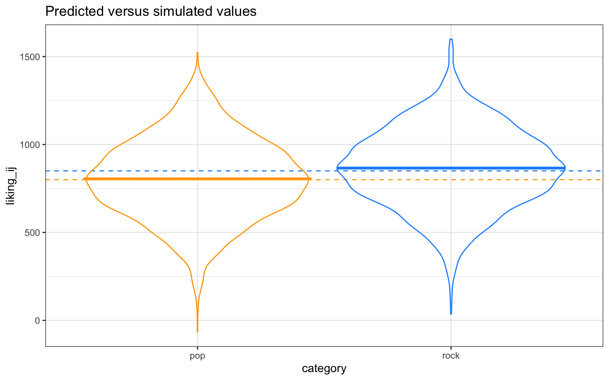

# (PART) Implementation {-}

# R 

## Simple linear regression


### Setup

The main library we will use is `stats` and comes bundled with base R. However, we also need to install a few additional libraries onto our machine and then load them into our search path. 


```r
# uncomment the line below to install the {pacman} library on your computer for the first time
# install.packages("pacman")
pacman::p_load(
  lme4,        # model specification / estimation
  lmtest,      # likelihood ratio tests
  faux,        # simulate from multivariate normal distribution
  afex,        # anova and deriving p-values from lmer
  broom.mixed, # extracting tidy data from model fits
  tidyverse,   # data wrangling and visualisation
  gt           # nice tables
  )
```

We will also set the pseudo-random number generator seed to 02138 to make the stochastic components of our simulations reproducible. 


```r
set.seed(02138)
```

### Data simulation step by step

Let's write some code that creates datasets under the alternative hypothesis.

#### Establish the data-generating parameters


```r
# set all data-generating parameters
beta_0  <- 800   # intercept; i.e., the grand mean
beta_1  <-  50   # slope; i.e, effect of category
tau_0   <- 100   # by-subject random intercept sd
tau_1   <-  40   # by-subject random slope sd
rho     <-   0.2 # correlation between intercept and slope
sigma   <- 200   # residual (error) sd
```

#### Simulate the sampling process


```r
# set number of subjects and items
n_subj <- 100 # number of subjects
n_pop  <-  25 # number of songs in pop category
n_rock <-  25 # number of songs in rock category
```

#### Simulate the sampling of songs


```r
# simulate a sample of songs
songs <- tibble(
  song_id = seq_len(n_pop + n_rock),
  category = rep(c("pop", "rock"), c(n_pop, n_rock)),
  genre_i = rep(c(0, 1), c(n_pop, n_rock))
)
```

#### Simulate the sampling of subjects

We will use the function `faux::rnorm_multi()`, which generates a table of `n` simulated values from a multivariate normal distribution by specifying the means (`mu`) and standard deviations (`sd`) of each variable, plus the correlations (`r`), which can be either a single value (applied to all pairs), a correlation matrix, or a vector of the values in the upper right triangle of the correlation matrix.


```r
# simulate a sample of subjects

# sample from a multivariate random distribution
subjects <- faux::rnorm_multi(
    n = n_subj,
    mu = 0, # means for random effects are always 0
    sd = c(tau_0, tau_1), # set SDs
    r = rho, # set correlation, see ?rnorm_multi
    varnames = c("b_0j", "b_1j")
  ) |>
  mutate(subj_id = seq_len(n_subj)) # add subject IDs
```

#### Check your values


```r
tibble(
  parameter = c("tau_0", "tau_1", "rho"),
  value = c(tau_0, tau_1, rho),
  simulated = c(
    sd(subjects$b_0j),
    sd(subjects$b_1j),
    cor(subjects$b_0j, subjects$b_1j)
  )
)
```

```
## # A tibble: 3 × 3
##   parameter value simulated
##   <chr>     <dbl>     <dbl>
## 1 tau_0     100     100.   
## 2 tau_1      40      39.2  
## 3 rho         0.2     0.116
```

#### Simulate trials


```r
# cross subject and song IDs; add an error term
trials <- crossing(subjects, songs) |>
  mutate(e_ij = rnorm(n(), mean = 0, sd = sigma))
```

#### Calculate response values


```r
dat_sim <- trials |>
  mutate(liking_ij = beta_0 + b_0j + (beta_1 + b_1j) * genre_i + e_ij) %>%
  select(subj_id, category, genre_i, liking_ij)
```

#### Plot the data


```r
dat_sim |>
ggplot(aes(category, liking_ij, color = category)) +
  # predicted means
  geom_hline(yintercept = (beta_0 + 0*beta_1), 
             color = "orange", linetype = "dashed") +
  geom_hline(yintercept = (beta_0 + 1*beta_1), 
             color = "dodgerblue", linetype = "dashed") +
  # actual data
  geom_violin(alpha = 0, show.legend = FALSE) +
  stat_summary(fun = mean, geom="crossbar", show.legend = FALSE) +
  scale_color_manual(values = c("orange", "dodgerblue")) +
  ggtitle("Predicted versus simulated values") +
  theme_bw()
```



#### Analyze the simulated data


```r
# fit a linear mixed-effects model to data
mod_sim <- lmer(liking_ij ~ 1 + genre_i + (1 + genre_i | subj_id), data = dat_sim)

summary(mod_sim, corr = FALSE)
```

```
## Linear mixed model fit by REML. t-tests use Satterthwaite's method [
## lmerModLmerTest]
## Formula: liking_ij ~ 1 + genre_i + (1 + genre_i | subj_id)
##    Data: dat_sim
## 
## REML criterion at convergence: 67393.3
## 
## Scaled residuals: 
##     Min      1Q  Median      3Q     Max 
## -3.6245 -0.6466  0.0026  0.6804  3.1317 
## 
## Random effects:
##  Groups   Name        Variance Std.Dev. Corr
##  subj_id  (Intercept) 10510    102.52       
##           genre_i      1130     33.62   0.09
##  Residual             39481    198.70       
## Number of obs: 5000, groups:  subj_id, 100
## 
## Fixed effects:
##             Estimate Std. Error      df t value Pr(>|t|)    
## (Intercept)  804.651     10.995  98.995  73.183  < 2e-16 ***
## genre_i       61.378      6.549  98.998   9.372 2.56e-15 ***
## ---
## Signif. codes:  0 '***' 0.001 '**' 0.01 '*' 0.05 '.' 0.1 ' ' 1
```

Use `broom.mixed::tidy(mod_sim)` to get a tidy table of the results. Below, we added column "parameter" and "value", so you can compare the estimate from the model to the parameters you used to simulate the data. 


```r
# get a tidy table of results
broom.mixed::tidy(mod_sim) |>
  mutate_if(is.numeric, round, 3) |>
  mutate(
    parameter = c("beta_0", "beta_1", "tau_0", "rho", "tau_1", "sigma"),
    value = c(beta_0, beta_1, tau_0, rho, tau_1, sigma),
  ) |>
  select(term, parameter, value, estimate) |>
  knitr::kable()
```


|term                     |parameter | value| estimate|
|:------------------------|:---------|-----:|--------:|
|(Intercept)              |beta_0    | 800.0|  804.651|
|genre_i                  |beta_1    |  50.0|   61.378|
|sd__(Intercept)          |tau_0     | 100.0|  102.518|
|cor__(Intercept).genre_i |rho       |   0.2|    0.089|
|sd__genre_i              |tau_1     |  40.0|   33.620|
|sd__Observation          |sigma     | 200.0|  198.698|

### Data simulation using a function

Once you've tested your data generating code above, put it into a function so you can run it repeatedly.


```r
# set up the custom data simulation function
sim_data <- function(
  n_subj     = 100,   # number of subjects
  n_pop      =  25,   # number of pop songs
  n_rock     =  25,   # number of rock songs
  beta_0     = 800,   # grand mean
  beta_1     =  50,   # effect of category
  tau_0      = 100,   # by-subject random intercept sd
  tau_1      =  40,   # by-subject random slope sd
  rho        =   0.2, # correlation between intercept and slope
  sigma      = 200)   # residual (standard deviation)
{
  # simulate a sample of songs
  songs <- tibble(
    song_id = seq_len(n_pop + n_rock),
    category = rep(c("pop", "rock"), c(n_pop, n_rock)),
    genre_i = rep(c(0, 1), c(n_pop, n_rock))
  )

  # simulate a sample of subjects
  subjects <- faux::rnorm_multi(
    n = n_subj,
    mu = 0,
    sd = c(tau_0, tau_1),
    r = rho,
    varnames = c("b_0j", "b_1j")
  ) |>
  mutate(subj_id = seq_len(n_subj))

# cross subject and song IDs
crossing(subjects, songs) |>
  mutate(e_ij = rnorm(n(), mean = 0, sd = sigma),
         liking_ij = beta_0 + b_0j + (beta_1 + b_1j) * genre_i + e_ij) |>
  select(subj_id, category, genre_i, liking_ij)
}
```

### Calculate power

We can wrap the data generating function and analysis code in a new function (`power_run()`) that returns a tidy table of the analysis results, and optionally saves this info to a file if you set a filename.


```r
# set up the power function
power_run <- function(...) {
  # ... is a shortcut that forwards any additional arguments to sim_data()
  dat_sim <- sim_data(...)
  mod_sim <- lmer(liking_ij ~ genre_i + (1 + genre_i | subj_id), data = dat_sim)
  broom.mixed::tidy(mod_sim)
}
```


```r
# run one model with default parameters
power_run()
```

```
## # A tibble: 6 × 8
##   effect   group    term            estimate std.error statistic    df   p.value
##   <chr>    <chr>    <chr>              <dbl>     <dbl>     <dbl> <dbl>     <dbl>
## 1 fixed    <NA>     (Intercept)      795.         9.99     79.6   99.0  1.42e-91
## 2 fixed    <NA>     genre_i           57.9        6.97      8.30  99.0  5.51e-13
## 3 ran_pars subj_id  sd__(Intercept)   91.4       NA        NA     NA   NA       
## 4 ran_pars subj_id  cor__(Intercep…    0.425     NA        NA     NA   NA       
## 5 ran_pars subj_id  sd__genre_i       40.3       NA        NA     NA   NA       
## 6 ran_pars Residual sd__Observation  201.        NA        NA     NA   NA
```


```r
# run one model with new parameters
power_run(n_pop = 50, n_rock = 45, beta_1 = 20)
```

```
## # A tibble: 6 × 8
##   effect   group    term            estimate std.error statistic    df   p.value
##   <chr>    <chr>    <chr>              <dbl>     <dbl>     <dbl> <dbl>     <dbl>
## 1 fixed    <NA>     (Intercept)      805.        11.0      72.9   99.0  7.79e-88
## 2 fixed    <NA>     genre_i           25.8        5.61      4.60  99.0  1.25e- 5
## 3 ran_pars subj_id  sd__(Intercept)  107.        NA        NA     NA   NA       
## 4 ran_pars subj_id  cor__(Intercep…    0.174     NA        NA     NA   NA       
## 5 ran_pars subj_id  sd__genre_i       38.2       NA        NA     NA   NA       
## 6 ran_pars Residual sd__Observation  200.        NA        NA     NA   NA
```

### Automate the power calculation

To get an accurate estimation of power, we need to run the simulation many times. We use 100 here as an example, but the results will be more accurate the more replications you run. This will depend on the specifics of your analysis, but we recommend at least 1000 replications.


```r
reps <- 50
sims <- map_df(1:reps, ~ power_run())
```


```r
# calculate mean estimates and power for specified alpha
alpha <- 0.05

sims |>
  filter(effect == "fixed") |>
  group_by(term) |>
  summarise(
    mean_estimate = mean(estimate),
    mean_se = mean(std.error),
    power = mean(p.value < alpha),
    .groups = "drop"
  )
```

```
## # A tibble: 2 × 4
##   term        mean_estimate mean_se power
##   <chr>               <dbl>   <dbl> <dbl>
## 1 (Intercept)         799.    10.6      1
## 2 genre_i              51.3    6.86     1
```

#### Check false positive rate

Set the effect of `genre_ij` to 0 to calculate the false positive rate. This is the probability of concluding there is an effect when there is no actual effect in your population.


```r
# run simulations and calculate the false positive rate
reps <- 100
sims_fp <- map_df(1:reps, ~ power_run(beta_1 = 0))

# calculate mean estimates and power for specified alpha
alpha <- 0.05

sims_fp |>
  filter(term == "genre_i") |>
  summarise(power = mean(p.value < alpha))
```

```
## # A tibble: 1 × 1
##   power
##   <dbl>
## 1  0.06
```

Ideally, the false positive rate will be equal to alpha, which we set here at 0.05. 


### Steps 4-5: Simulate and automate

Next, let's write a function that creates datasets under the alternative hypothesis.


```r
generate_design_matrix <- function(
  n_participants,
  n_songs,
  genres = c("rock", "pop")
  )
{
  crossing(
    participant = 1:n_participants,
    genre = genres,
    song = 1:n_songs
    ) |>
  mutate(song = paste(genre, song, sep = "_"))
}
```


```r
data1 <- generate_design_matrix(1000, 2, 1)

group_means <- c(rock = 75, pop = 75) # define means of both genres in a vector
rock_sd <- 7.5 # define sd of rock music
pop_sd <- 7.5 # define sd of pop music
correlation <- 0.2 # define their correlation

sigma <- matrix(c(
  rock_sd^2, rock_sd*pop_sd*correlation,
  rock_sd*pop_sd*correlation, pop_sd^2),
  ncol = 2) # define variance-covariance matrix

set.seed(123)
bivnorm <- data.frame(mvrnorm(nrow(data1)/2, group_means, sigma)) # simulate bivariate normal (we use nrow(data1)/2, the number of rows from the data-set above to simulate 10 observations per group)
par(mfrow=c(1,2))
hist(bivnorm$rock, main = "liking of rock music", xlab = "")
hist(bivnorm$pop, main = "liking of pop music", xlab = "")
```

A matrix containing the variances of both groups (rock and pop) and their covariance (i.e. $\textrm{rock_sd}^2 = 56.25$ and $\textrm{pop_sd}^2 = 56.25$ and the covariances between the groups $\textrm{rock_sd} \times \textrm{pop_sd} \times \textrm{correlation} = 11.25$) that looks like this:

$$
\begin{bmatrix}
56.25 & 11.25 \\
11.25 & 56.25
\end{bmatrix}
$$


```r
bivnorm_dat <- data.frame(cbind(liking = c(bivnorm$rock, bivnorm$pop), genre = c(rep("rock", (nrow(data1)/2)), rep("pop", (nrow(data1)/2))), participant = rep(1:(nrow(data1)/2), 2))) # this just converts bivnorm to long format and adds the genre variable

bivnorm_dat$liking <- as.numeric(bivnorm_dat$liking) # variable was converted to character for some reason in cbind so lets make it numerical again

bivnorm_dat$genre_f <- factor(bivnorm_dat$genre) # make genre a factor

lmer_bivnorm <- lmer(liking ~ genre_f + (1 | participant), bivnorm_dat)
summary(lmer_bivnorm)
```


Next, let's write a function that creates datasets under the alternative hypothesis, fits the models, and uses a likelihood-ratio test to calculate power.


### Step 6: Summarize

Here's the table from the simulation.


```r
power_list |>
  gt() |>
  tab_header(title="Power values for GLM") |>
  data_color(
    columns=power,
    colors=scales::col_numeric(
      palette=c("red", "green"),
      domain=c(0, 1)
      )
  )
```

Here's the graph from the simulation. 


```r
power_list |>
  mutate(sample_n = factor(sample_n)) |>
  ggplot(aes(x=interact_coef, y=power, 
             group=sample_n, color=sample_n)) + 
  geom_line() + 
  geom_point(size=4) + 
  ylim(0, 1) +
  theme_bw()
```

## Mixed effects model

For the mixed effects model example, we will continue to use the same R libraries and pseudo-random number generator seed as previously.

### Step 4-5: Simulate & automate

Next, let's write a function that creates datasets under the alternative hypothesis, fits the mixed effects models, tests the null hypothesis of interest, and uses a for loop to run many iterations of the function. 


### Step 6: Summarize

The table for the mixed effects model.


```r
power_list_mixed |>
  gt() |>
  tab_header(title="Power values for mixed effects model") |>
  data_color(
    columns=power,
    colors=scales::col_numeric(
      palette=c("red", "green"),
      domain=c(0, 1)
      )
  )
```

The graph of the simulation result for mixed effects model.


```r
power_list_mixed |>
  mutate(obs = factor(obs)) |>
  ggplot(aes(x=sample, y=power, 
             group=obs, color=obs)) + 
  geom_line() + 
  geom_point(size=4) + 
  ylim(0, 1) +
  theme_bw()
```
