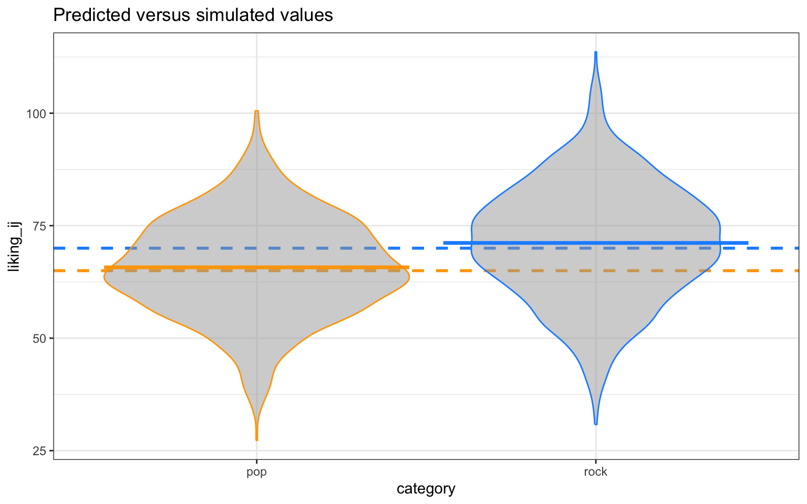

# (PART) Implementation {-}

# R 

## Simple linear regression

### Setup

The main library we will use is `stats` and comes bundled with base R. However, we also need to install a few additional libraries onto our machine and then load them into our search path. 


```r
# install.packages("pacman")
pacman::p_load(lmtest, lme4, dplyr, ggplot2, gt)
```

We will also set the pseudo-random number generator seed to 02138 to make the stochastic components of our simulations reproducible. 


```r
set.seed(02138)
```

### Steps 4-5: Simulate and automate

Next, let's write a function that creates datasets under the alternative hypothesis, fits the models, and uses a likelihood-ratio test to calculate power.


```r
sample_n <- c(400, 500, 600, 700)
interact_coef <- c(0.2, 0.25, 0.3, 0.35, 0.4)
repeats <- 1:1000

power_list <- data.frame(sample_n=double(), 
                         interact_coef=double(), 
                         power=double()
                         )[-1, ]

for (s in sample_n) {
  
  for (i in interact_coef){
    
    results <- c()
    
    for (r in repeats){
      
      age <- ceiling(runif(s, 18, 65))
      female <- rbinom(s, 1, 0.5)
      interact <- age * female
      e <- rnorm(s, 0, 20)
      sbp <- 110 + 0.5*age + (-20)*female + i*interact + e
      dataset <- data.frame(sbp, age, female, interact)
      
      full_model <- lm(sbp ~ age + female + interact, data=dataset)
      reduced_model <- lm(sbp ~ age + female, data=dataset)
      prob <- lrtest(full_model, reduced_model)$Pr[2]
      reject <- ifelse((prob<=0.05), 1, 0)
      
      results <- rbind(results, reject)
      
    }
    
    power_list <- rbind(power_list, 
                        data.frame(sample_n=s, 
                                   interact_coef=i, 
                                   power=mean(results)
                                   )
                        )
    
  }  
}
```

### Step 6: Summarize & visualize

Here's the table from the simulation.


```r
power_list |>
  gt() |>
  tab_header(title="Power values for GLM") |>
  data_color(
    columns=power,
    colors=scales::col_numeric(
      palette=c("red", "green"),
      domain=c(0, 1)
      )
  )
```

```{=html}
<div id="nqwmwvihjq" style="padding-left:0px;padding-right:0px;padding-top:10px;padding-bottom:10px;overflow-x:auto;overflow-y:auto;width:auto;height:auto;">
<style>html {
  font-family: -apple-system, BlinkMacSystemFont, 'Segoe UI', Roboto, Oxygen, Ubuntu, Cantarell, 'Helvetica Neue', 'Fira Sans', 'Droid Sans', Arial, sans-serif;
}

#nqwmwvihjq .gt_table {
  display: table;
  border-collapse: collapse;
  margin-left: auto;
  margin-right: auto;
  color: #333333;
  font-size: 16px;
  font-weight: normal;
  font-style: normal;
  background-color: #FFFFFF;
  width: auto;
  border-top-style: solid;
  border-top-width: 2px;
  border-top-color: #A8A8A8;
  border-right-style: none;
  border-right-width: 2px;
  border-right-color: #D3D3D3;
  border-bottom-style: solid;
  border-bottom-width: 2px;
  border-bottom-color: #A8A8A8;
  border-left-style: none;
  border-left-width: 2px;
  border-left-color: #D3D3D3;
}

#nqwmwvihjq .gt_heading {
  background-color: #FFFFFF;
  text-align: center;
  border-bottom-color: #FFFFFF;
  border-left-style: none;
  border-left-width: 1px;
  border-left-color: #D3D3D3;
  border-right-style: none;
  border-right-width: 1px;
  border-right-color: #D3D3D3;
}

#nqwmwvihjq .gt_caption {
  padding-top: 4px;
  padding-bottom: 4px;
}

#nqwmwvihjq .gt_title {
  color: #333333;
  font-size: 125%;
  font-weight: initial;
  padding-top: 4px;
  padding-bottom: 4px;
  padding-left: 5px;
  padding-right: 5px;
  border-bottom-color: #FFFFFF;
  border-bottom-width: 0;
}

#nqwmwvihjq .gt_subtitle {
  color: #333333;
  font-size: 85%;
  font-weight: initial;
  padding-top: 0;
  padding-bottom: 6px;
  padding-left: 5px;
  padding-right: 5px;
  border-top-color: #FFFFFF;
  border-top-width: 0;
}

#nqwmwvihjq .gt_bottom_border {
  border-bottom-style: solid;
  border-bottom-width: 2px;
  border-bottom-color: #D3D3D3;
}

#nqwmwvihjq .gt_col_headings {
  border-top-style: solid;
  border-top-width: 2px;
  border-top-color: #D3D3D3;
  border-bottom-style: solid;
  border-bottom-width: 2px;
  border-bottom-color: #D3D3D3;
  border-left-style: none;
  border-left-width: 1px;
  border-left-color: #D3D3D3;
  border-right-style: none;
  border-right-width: 1px;
  border-right-color: #D3D3D3;
}

#nqwmwvihjq .gt_col_heading {
  color: #333333;
  background-color: #FFFFFF;
  font-size: 100%;
  font-weight: normal;
  text-transform: inherit;
  border-left-style: none;
  border-left-width: 1px;
  border-left-color: #D3D3D3;
  border-right-style: none;
  border-right-width: 1px;
  border-right-color: #D3D3D3;
  vertical-align: bottom;
  padding-top: 5px;
  padding-bottom: 6px;
  padding-left: 5px;
  padding-right: 5px;
  overflow-x: hidden;
}

#nqwmwvihjq .gt_column_spanner_outer {
  color: #333333;
  background-color: #FFFFFF;
  font-size: 100%;
  font-weight: normal;
  text-transform: inherit;
  padding-top: 0;
  padding-bottom: 0;
  padding-left: 4px;
  padding-right: 4px;
}

#nqwmwvihjq .gt_column_spanner_outer:first-child {
  padding-left: 0;
}

#nqwmwvihjq .gt_column_spanner_outer:last-child {
  padding-right: 0;
}

#nqwmwvihjq .gt_column_spanner {
  border-bottom-style: solid;
  border-bottom-width: 2px;
  border-bottom-color: #D3D3D3;
  vertical-align: bottom;
  padding-top: 5px;
  padding-bottom: 5px;
  overflow-x: hidden;
  display: inline-block;
  width: 100%;
}

#nqwmwvihjq .gt_group_heading {
  padding-top: 8px;
  padding-bottom: 8px;
  padding-left: 5px;
  padding-right: 5px;
  color: #333333;
  background-color: #FFFFFF;
  font-size: 100%;
  font-weight: initial;
  text-transform: inherit;
  border-top-style: solid;
  border-top-width: 2px;
  border-top-color: #D3D3D3;
  border-bottom-style: solid;
  border-bottom-width: 2px;
  border-bottom-color: #D3D3D3;
  border-left-style: none;
  border-left-width: 1px;
  border-left-color: #D3D3D3;
  border-right-style: none;
  border-right-width: 1px;
  border-right-color: #D3D3D3;
  vertical-align: middle;
  text-align: left;
}

#nqwmwvihjq .gt_empty_group_heading {
  padding: 0.5px;
  color: #333333;
  background-color: #FFFFFF;
  font-size: 100%;
  font-weight: initial;
  border-top-style: solid;
  border-top-width: 2px;
  border-top-color: #D3D3D3;
  border-bottom-style: solid;
  border-bottom-width: 2px;
  border-bottom-color: #D3D3D3;
  vertical-align: middle;
}

#nqwmwvihjq .gt_from_md > :first-child {
  margin-top: 0;
}

#nqwmwvihjq .gt_from_md > :last-child {
  margin-bottom: 0;
}

#nqwmwvihjq .gt_row {
  padding-top: 8px;
  padding-bottom: 8px;
  padding-left: 5px;
  padding-right: 5px;
  margin: 10px;
  border-top-style: solid;
  border-top-width: 1px;
  border-top-color: #D3D3D3;
  border-left-style: none;
  border-left-width: 1px;
  border-left-color: #D3D3D3;
  border-right-style: none;
  border-right-width: 1px;
  border-right-color: #D3D3D3;
  vertical-align: middle;
  overflow-x: hidden;
}

#nqwmwvihjq .gt_stub {
  color: #333333;
  background-color: #FFFFFF;
  font-size: 100%;
  font-weight: initial;
  text-transform: inherit;
  border-right-style: solid;
  border-right-width: 2px;
  border-right-color: #D3D3D3;
  padding-left: 5px;
  padding-right: 5px;
}

#nqwmwvihjq .gt_stub_row_group {
  color: #333333;
  background-color: #FFFFFF;
  font-size: 100%;
  font-weight: initial;
  text-transform: inherit;
  border-right-style: solid;
  border-right-width: 2px;
  border-right-color: #D3D3D3;
  padding-left: 5px;
  padding-right: 5px;
  vertical-align: top;
}

#nqwmwvihjq .gt_row_group_first td {
  border-top-width: 2px;
}

#nqwmwvihjq .gt_summary_row {
  color: #333333;
  background-color: #FFFFFF;
  text-transform: inherit;
  padding-top: 8px;
  padding-bottom: 8px;
  padding-left: 5px;
  padding-right: 5px;
}

#nqwmwvihjq .gt_first_summary_row {
  border-top-style: solid;
  border-top-color: #D3D3D3;
}

#nqwmwvihjq .gt_first_summary_row.thick {
  border-top-width: 2px;
}

#nqwmwvihjq .gt_last_summary_row {
  padding-top: 8px;
  padding-bottom: 8px;
  padding-left: 5px;
  padding-right: 5px;
  border-bottom-style: solid;
  border-bottom-width: 2px;
  border-bottom-color: #D3D3D3;
}

#nqwmwvihjq .gt_grand_summary_row {
  color: #333333;
  background-color: #FFFFFF;
  text-transform: inherit;
  padding-top: 8px;
  padding-bottom: 8px;
  padding-left: 5px;
  padding-right: 5px;
}

#nqwmwvihjq .gt_first_grand_summary_row {
  padding-top: 8px;
  padding-bottom: 8px;
  padding-left: 5px;
  padding-right: 5px;
  border-top-style: double;
  border-top-width: 6px;
  border-top-color: #D3D3D3;
}

#nqwmwvihjq .gt_striped {
  background-color: rgba(128, 128, 128, 0.05);
}

#nqwmwvihjq .gt_table_body {
  border-top-style: solid;
  border-top-width: 2px;
  border-top-color: #D3D3D3;
  border-bottom-style: solid;
  border-bottom-width: 2px;
  border-bottom-color: #D3D3D3;
}

#nqwmwvihjq .gt_footnotes {
  color: #333333;
  background-color: #FFFFFF;
  border-bottom-style: none;
  border-bottom-width: 2px;
  border-bottom-color: #D3D3D3;
  border-left-style: none;
  border-left-width: 2px;
  border-left-color: #D3D3D3;
  border-right-style: none;
  border-right-width: 2px;
  border-right-color: #D3D3D3;
}

#nqwmwvihjq .gt_footnote {
  margin: 0px;
  font-size: 90%;
  padding-left: 4px;
  padding-right: 4px;
  padding-left: 5px;
  padding-right: 5px;
}

#nqwmwvihjq .gt_sourcenotes {
  color: #333333;
  background-color: #FFFFFF;
  border-bottom-style: none;
  border-bottom-width: 2px;
  border-bottom-color: #D3D3D3;
  border-left-style: none;
  border-left-width: 2px;
  border-left-color: #D3D3D3;
  border-right-style: none;
  border-right-width: 2px;
  border-right-color: #D3D3D3;
}

#nqwmwvihjq .gt_sourcenote {
  font-size: 90%;
  padding-top: 4px;
  padding-bottom: 4px;
  padding-left: 5px;
  padding-right: 5px;
}

#nqwmwvihjq .gt_left {
  text-align: left;
}

#nqwmwvihjq .gt_center {
  text-align: center;
}

#nqwmwvihjq .gt_right {
  text-align: right;
  font-variant-numeric: tabular-nums;
}

#nqwmwvihjq .gt_font_normal {
  font-weight: normal;
}

#nqwmwvihjq .gt_font_bold {
  font-weight: bold;
}

#nqwmwvihjq .gt_font_italic {
  font-style: italic;
}

#nqwmwvihjq .gt_super {
  font-size: 65%;
}

#nqwmwvihjq .gt_footnote_marks {
  font-style: italic;
  font-weight: normal;
  font-size: 75%;
  vertical-align: 0.4em;
}

#nqwmwvihjq .gt_asterisk {
  font-size: 100%;
  vertical-align: 0;
}

#nqwmwvihjq .gt_indent_1 {
  text-indent: 5px;
}

#nqwmwvihjq .gt_indent_2 {
  text-indent: 10px;
}

#nqwmwvihjq .gt_indent_3 {
  text-indent: 15px;
}

#nqwmwvihjq .gt_indent_4 {
  text-indent: 20px;
}

#nqwmwvihjq .gt_indent_5 {
  text-indent: 25px;
}
</style>
<table class="gt_table">
  <thead class="gt_header">
    <tr>
      <td colspan="3" class="gt_heading gt_title gt_font_normal gt_bottom_border" style>Power values for GLM</td>
    </tr>
    
  </thead>
  <thead class="gt_col_headings">
    <tr>
      <th class="gt_col_heading gt_columns_bottom_border gt_right" rowspan="1" colspan="1" scope="col" id="sample_n">sample_n</th>
      <th class="gt_col_heading gt_columns_bottom_border gt_right" rowspan="1" colspan="1" scope="col" id="interact_coef">interact_coef</th>
      <th class="gt_col_heading gt_columns_bottom_border gt_right" rowspan="1" colspan="1" scope="col" id="power">power</th>
    </tr>
  </thead>
  <tbody class="gt_table_body">
    <tr><td headers="sample_n" class="gt_row gt_right">400</td>
<td headers="interact_coef" class="gt_row gt_right">0.20</td>
<td headers="power" class="gt_row gt_right" style="background-color: #E87800; color: #FFFFFF;">0.256</td></tr>
    <tr><td headers="sample_n" class="gt_row gt_right">400</td>
<td headers="interact_coef" class="gt_row gt_right">0.25</td>
<td headers="power" class="gt_row gt_right" style="background-color: #D79700; color: #000000;">0.399</td></tr>
    <tr><td headers="sample_n" class="gt_row gt_right">400</td>
<td headers="interact_coef" class="gt_row gt_right">0.30</td>
<td headers="power" class="gt_row gt_right" style="background-color: #C1B300; color: #000000;">0.545</td></tr>
    <tr><td headers="sample_n" class="gt_row gt_right">400</td>
<td headers="interact_coef" class="gt_row gt_right">0.35</td>
<td headers="power" class="gt_row gt_right" style="background-color: #AFC500; color: #000000;">0.646</td></tr>
    <tr><td headers="sample_n" class="gt_row gt_right">400</td>
<td headers="interact_coef" class="gt_row gt_right">0.40</td>
<td headers="power" class="gt_row gt_right" style="background-color: #8DDD00; color: #000000;">0.790</td></tr>
    <tr><td headers="sample_n" class="gt_row gt_right">500</td>
<td headers="interact_coef" class="gt_row gt_right">0.20</td>
<td headers="power" class="gt_row gt_right" style="background-color: #E28300; color: #FFFFFF;">0.305</td></tr>
    <tr><td headers="sample_n" class="gt_row gt_right">500</td>
<td headers="interact_coef" class="gt_row gt_right">0.25</td>
<td headers="power" class="gt_row gt_right" style="background-color: #CDA500; color: #000000;">0.468</td></tr>
    <tr><td headers="sample_n" class="gt_row gt_right">500</td>
<td headers="interact_coef" class="gt_row gt_right">0.30</td>
<td headers="power" class="gt_row gt_right" style="background-color: #B5C000; color: #000000;">0.615</td></tr>
    <tr><td headers="sample_n" class="gt_row gt_right">500</td>
<td headers="interact_coef" class="gt_row gt_right">0.35</td>
<td headers="power" class="gt_row gt_right" style="background-color: #96D800; color: #000000;">0.758</td></tr>
    <tr><td headers="sample_n" class="gt_row gt_right">500</td>
<td headers="interact_coef" class="gt_row gt_right">0.40</td>
<td headers="power" class="gt_row gt_right" style="background-color: #7CE600; color: #000000;">0.843</td></tr>
    <tr><td headers="sample_n" class="gt_row gt_right">600</td>
<td headers="interact_coef" class="gt_row gt_right">0.20</td>
<td headers="power" class="gt_row gt_right" style="background-color: #D89500; color: #FFFFFF;">0.386</td></tr>
    <tr><td headers="sample_n" class="gt_row gt_right">600</td>
<td headers="interact_coef" class="gt_row gt_right">0.25</td>
<td headers="power" class="gt_row gt_right" style="background-color: #BFB600; color: #000000;">0.558</td></tr>
    <tr><td headers="sample_n" class="gt_row gt_right">600</td>
<td headers="interact_coef" class="gt_row gt_right">0.30</td>
<td headers="power" class="gt_row gt_right" style="background-color: #A7CC00; color: #000000;">0.684</td></tr>
    <tr><td headers="sample_n" class="gt_row gt_right">600</td>
<td headers="interact_coef" class="gt_row gt_right">0.35</td>
<td headers="power" class="gt_row gt_right" style="background-color: #81E400; color: #000000;">0.830</td></tr>
    <tr><td headers="sample_n" class="gt_row gt_right">600</td>
<td headers="interact_coef" class="gt_row gt_right">0.40</td>
<td headers="power" class="gt_row gt_right" style="background-color: #60F100; color: #000000;">0.911</td></tr>
    <tr><td headers="sample_n" class="gt_row gt_right">700</td>
<td headers="interact_coef" class="gt_row gt_right">0.20</td>
<td headers="power" class="gt_row gt_right" style="background-color: #D59A00; color: #000000;">0.413</td></tr>
    <tr><td headers="sample_n" class="gt_row gt_right">700</td>
<td headers="interact_coef" class="gt_row gt_right">0.25</td>
<td headers="power" class="gt_row gt_right" style="background-color: #B7BE00; color: #000000;">0.607</td></tr>
    <tr><td headers="sample_n" class="gt_row gt_right">700</td>
<td headers="interact_coef" class="gt_row gt_right">0.30</td>
<td headers="power" class="gt_row gt_right" style="background-color: #8BDE00; color: #000000;">0.795</td></tr>
    <tr><td headers="sample_n" class="gt_row gt_right">700</td>
<td headers="interact_coef" class="gt_row gt_right">0.35</td>
<td headers="power" class="gt_row gt_right" style="background-color: #6BED00; color: #000000;">0.887</td></tr>
    <tr><td headers="sample_n" class="gt_row gt_right">700</td>
<td headers="interact_coef" class="gt_row gt_right">0.40</td>
<td headers="power" class="gt_row gt_right" style="background-color: #48F700; color: #000000;">0.951</td></tr>
  </tbody>
  
  
</table>
</div>
```

Here's the graph from the simulation. 


```r
power_list |>
  mutate(sample_n = factor(sample_n)) |>
  ggplot(aes(x=interact_coef, y=power, 
             group=sample_n, color=sample_n)) + 
  geom_line() + 
  geom_point(size=4) + 
  ylim(0, 1) +
  theme_bw()
```


## Mixed effects model

For the mixed effects model example, we will continue to use the same R libraries and pseudo-random number generator seed as previously.

### Step 4-5: Simulate & automate

Next, let's write a function that creates datasets under the alternative hypothesis, fits the mixed effects models, tests the null hypothesis of interest, and uses a for loop to run many iterations of the function. 


```r
sample_n <- c(100, 200, 300, 400, 500)
obs_n <- c(3, 5)
reps_n <- 1:100

power_list_mixed <- data.frame(obs=integer(), 
                               sample=integer(), 
                               power=double()
                               )

for (s in sample_n){
  
  for (o in obs_n){
    
    results <- c()
    
    for (r in reps_n){
      
      data.frame(
        child = factor(1:s), 
        female = rbinom(s, 1, 0.5),
        u_0i = rnorm(s, 0, 0.8),
        u_1i = rnorm(s, 0, 1.7)
        ) ->
      data_set
      
      data_set_expand <- data_set[rep(seq(nrow(data_set)), o), 1:4]

      age <- c()
      for (obser in seq(0, (o-1)*0.5, 0.5)){
        age <- c(age, rep(obser, s))
      }

      data_set_expand |>
        mutate(age = age,
               e_ij = rnorm(s*o, 0, 1.35),
               interact = age * female,
               weight = 5.35 + 2.1*age + (-0.35)*female + (-0.55)*interact + u_0i + age*u_1i + e_ij
               ) ->
      data_set_expand

      full_model <- lmer(weight ~ age + female + interact + (age || child), 
                         data=data_set_expand)
      reduced_model <- lmer(weight ~ age + female + (age || child), 
                            data=data_set_expand)
      prob <- lrtest(full_model, reduced_model)$Pr[2]
      reject <- ifelse((prob<=0.05), 1, 0)
      results <- rbind(results, reject)     
    }
    
    power_list_mixed <- rbind(power_list_mixed, 
                              data.frame(obs=o, 
                                         sample=s, 
                                         power=mean(results)
                                         )
                              )
    
  }
}
```

### Step 6: Summarize & visualize

The table for the mixed effects model.


```r
power_list_mixed |>
  gt() |>
  tab_header(title="Power values for mixed effects model") |>
  data_color(
    columns=power,
    colors=scales::col_numeric(
      palette=c("red", "green"),
      domain=c(0, 1)
      )
  )
```

```{=html}
<div id="sixdmjfjis" style="padding-left:0px;padding-right:0px;padding-top:10px;padding-bottom:10px;overflow-x:auto;overflow-y:auto;width:auto;height:auto;">
<style>html {
  font-family: -apple-system, BlinkMacSystemFont, 'Segoe UI', Roboto, Oxygen, Ubuntu, Cantarell, 'Helvetica Neue', 'Fira Sans', 'Droid Sans', Arial, sans-serif;
}

#sixdmjfjis .gt_table {
  display: table;
  border-collapse: collapse;
  margin-left: auto;
  margin-right: auto;
  color: #333333;
  font-size: 16px;
  font-weight: normal;
  font-style: normal;
  background-color: #FFFFFF;
  width: auto;
  border-top-style: solid;
  border-top-width: 2px;
  border-top-color: #A8A8A8;
  border-right-style: none;
  border-right-width: 2px;
  border-right-color: #D3D3D3;
  border-bottom-style: solid;
  border-bottom-width: 2px;
  border-bottom-color: #A8A8A8;
  border-left-style: none;
  border-left-width: 2px;
  border-left-color: #D3D3D3;
}

#sixdmjfjis .gt_heading {
  background-color: #FFFFFF;
  text-align: center;
  border-bottom-color: #FFFFFF;
  border-left-style: none;
  border-left-width: 1px;
  border-left-color: #D3D3D3;
  border-right-style: none;
  border-right-width: 1px;
  border-right-color: #D3D3D3;
}

#sixdmjfjis .gt_caption {
  padding-top: 4px;
  padding-bottom: 4px;
}

#sixdmjfjis .gt_title {
  color: #333333;
  font-size: 125%;
  font-weight: initial;
  padding-top: 4px;
  padding-bottom: 4px;
  padding-left: 5px;
  padding-right: 5px;
  border-bottom-color: #FFFFFF;
  border-bottom-width: 0;
}

#sixdmjfjis .gt_subtitle {
  color: #333333;
  font-size: 85%;
  font-weight: initial;
  padding-top: 0;
  padding-bottom: 6px;
  padding-left: 5px;
  padding-right: 5px;
  border-top-color: #FFFFFF;
  border-top-width: 0;
}

#sixdmjfjis .gt_bottom_border {
  border-bottom-style: solid;
  border-bottom-width: 2px;
  border-bottom-color: #D3D3D3;
}

#sixdmjfjis .gt_col_headings {
  border-top-style: solid;
  border-top-width: 2px;
  border-top-color: #D3D3D3;
  border-bottom-style: solid;
  border-bottom-width: 2px;
  border-bottom-color: #D3D3D3;
  border-left-style: none;
  border-left-width: 1px;
  border-left-color: #D3D3D3;
  border-right-style: none;
  border-right-width: 1px;
  border-right-color: #D3D3D3;
}

#sixdmjfjis .gt_col_heading {
  color: #333333;
  background-color: #FFFFFF;
  font-size: 100%;
  font-weight: normal;
  text-transform: inherit;
  border-left-style: none;
  border-left-width: 1px;
  border-left-color: #D3D3D3;
  border-right-style: none;
  border-right-width: 1px;
  border-right-color: #D3D3D3;
  vertical-align: bottom;
  padding-top: 5px;
  padding-bottom: 6px;
  padding-left: 5px;
  padding-right: 5px;
  overflow-x: hidden;
}

#sixdmjfjis .gt_column_spanner_outer {
  color: #333333;
  background-color: #FFFFFF;
  font-size: 100%;
  font-weight: normal;
  text-transform: inherit;
  padding-top: 0;
  padding-bottom: 0;
  padding-left: 4px;
  padding-right: 4px;
}

#sixdmjfjis .gt_column_spanner_outer:first-child {
  padding-left: 0;
}

#sixdmjfjis .gt_column_spanner_outer:last-child {
  padding-right: 0;
}

#sixdmjfjis .gt_column_spanner {
  border-bottom-style: solid;
  border-bottom-width: 2px;
  border-bottom-color: #D3D3D3;
  vertical-align: bottom;
  padding-top: 5px;
  padding-bottom: 5px;
  overflow-x: hidden;
  display: inline-block;
  width: 100%;
}

#sixdmjfjis .gt_group_heading {
  padding-top: 8px;
  padding-bottom: 8px;
  padding-left: 5px;
  padding-right: 5px;
  color: #333333;
  background-color: #FFFFFF;
  font-size: 100%;
  font-weight: initial;
  text-transform: inherit;
  border-top-style: solid;
  border-top-width: 2px;
  border-top-color: #D3D3D3;
  border-bottom-style: solid;
  border-bottom-width: 2px;
  border-bottom-color: #D3D3D3;
  border-left-style: none;
  border-left-width: 1px;
  border-left-color: #D3D3D3;
  border-right-style: none;
  border-right-width: 1px;
  border-right-color: #D3D3D3;
  vertical-align: middle;
  text-align: left;
}

#sixdmjfjis .gt_empty_group_heading {
  padding: 0.5px;
  color: #333333;
  background-color: #FFFFFF;
  font-size: 100%;
  font-weight: initial;
  border-top-style: solid;
  border-top-width: 2px;
  border-top-color: #D3D3D3;
  border-bottom-style: solid;
  border-bottom-width: 2px;
  border-bottom-color: #D3D3D3;
  vertical-align: middle;
}

#sixdmjfjis .gt_from_md > :first-child {
  margin-top: 0;
}

#sixdmjfjis .gt_from_md > :last-child {
  margin-bottom: 0;
}

#sixdmjfjis .gt_row {
  padding-top: 8px;
  padding-bottom: 8px;
  padding-left: 5px;
  padding-right: 5px;
  margin: 10px;
  border-top-style: solid;
  border-top-width: 1px;
  border-top-color: #D3D3D3;
  border-left-style: none;
  border-left-width: 1px;
  border-left-color: #D3D3D3;
  border-right-style: none;
  border-right-width: 1px;
  border-right-color: #D3D3D3;
  vertical-align: middle;
  overflow-x: hidden;
}

#sixdmjfjis .gt_stub {
  color: #333333;
  background-color: #FFFFFF;
  font-size: 100%;
  font-weight: initial;
  text-transform: inherit;
  border-right-style: solid;
  border-right-width: 2px;
  border-right-color: #D3D3D3;
  padding-left: 5px;
  padding-right: 5px;
}

#sixdmjfjis .gt_stub_row_group {
  color: #333333;
  background-color: #FFFFFF;
  font-size: 100%;
  font-weight: initial;
  text-transform: inherit;
  border-right-style: solid;
  border-right-width: 2px;
  border-right-color: #D3D3D3;
  padding-left: 5px;
  padding-right: 5px;
  vertical-align: top;
}

#sixdmjfjis .gt_row_group_first td {
  border-top-width: 2px;
}

#sixdmjfjis .gt_summary_row {
  color: #333333;
  background-color: #FFFFFF;
  text-transform: inherit;
  padding-top: 8px;
  padding-bottom: 8px;
  padding-left: 5px;
  padding-right: 5px;
}

#sixdmjfjis .gt_first_summary_row {
  border-top-style: solid;
  border-top-color: #D3D3D3;
}

#sixdmjfjis .gt_first_summary_row.thick {
  border-top-width: 2px;
}

#sixdmjfjis .gt_last_summary_row {
  padding-top: 8px;
  padding-bottom: 8px;
  padding-left: 5px;
  padding-right: 5px;
  border-bottom-style: solid;
  border-bottom-width: 2px;
  border-bottom-color: #D3D3D3;
}

#sixdmjfjis .gt_grand_summary_row {
  color: #333333;
  background-color: #FFFFFF;
  text-transform: inherit;
  padding-top: 8px;
  padding-bottom: 8px;
  padding-left: 5px;
  padding-right: 5px;
}

#sixdmjfjis .gt_first_grand_summary_row {
  padding-top: 8px;
  padding-bottom: 8px;
  padding-left: 5px;
  padding-right: 5px;
  border-top-style: double;
  border-top-width: 6px;
  border-top-color: #D3D3D3;
}

#sixdmjfjis .gt_striped {
  background-color: rgba(128, 128, 128, 0.05);
}

#sixdmjfjis .gt_table_body {
  border-top-style: solid;
  border-top-width: 2px;
  border-top-color: #D3D3D3;
  border-bottom-style: solid;
  border-bottom-width: 2px;
  border-bottom-color: #D3D3D3;
}

#sixdmjfjis .gt_footnotes {
  color: #333333;
  background-color: #FFFFFF;
  border-bottom-style: none;
  border-bottom-width: 2px;
  border-bottom-color: #D3D3D3;
  border-left-style: none;
  border-left-width: 2px;
  border-left-color: #D3D3D3;
  border-right-style: none;
  border-right-width: 2px;
  border-right-color: #D3D3D3;
}

#sixdmjfjis .gt_footnote {
  margin: 0px;
  font-size: 90%;
  padding-left: 4px;
  padding-right: 4px;
  padding-left: 5px;
  padding-right: 5px;
}

#sixdmjfjis .gt_sourcenotes {
  color: #333333;
  background-color: #FFFFFF;
  border-bottom-style: none;
  border-bottom-width: 2px;
  border-bottom-color: #D3D3D3;
  border-left-style: none;
  border-left-width: 2px;
  border-left-color: #D3D3D3;
  border-right-style: none;
  border-right-width: 2px;
  border-right-color: #D3D3D3;
}

#sixdmjfjis .gt_sourcenote {
  font-size: 90%;
  padding-top: 4px;
  padding-bottom: 4px;
  padding-left: 5px;
  padding-right: 5px;
}

#sixdmjfjis .gt_left {
  text-align: left;
}

#sixdmjfjis .gt_center {
  text-align: center;
}

#sixdmjfjis .gt_right {
  text-align: right;
  font-variant-numeric: tabular-nums;
}

#sixdmjfjis .gt_font_normal {
  font-weight: normal;
}

#sixdmjfjis .gt_font_bold {
  font-weight: bold;
}

#sixdmjfjis .gt_font_italic {
  font-style: italic;
}

#sixdmjfjis .gt_super {
  font-size: 65%;
}

#sixdmjfjis .gt_footnote_marks {
  font-style: italic;
  font-weight: normal;
  font-size: 75%;
  vertical-align: 0.4em;
}

#sixdmjfjis .gt_asterisk {
  font-size: 100%;
  vertical-align: 0;
}

#sixdmjfjis .gt_indent_1 {
  text-indent: 5px;
}

#sixdmjfjis .gt_indent_2 {
  text-indent: 10px;
}

#sixdmjfjis .gt_indent_3 {
  text-indent: 15px;
}

#sixdmjfjis .gt_indent_4 {
  text-indent: 20px;
}

#sixdmjfjis .gt_indent_5 {
  text-indent: 25px;
}
</style>
<table class="gt_table">
  <thead class="gt_header">
    <tr>
      <td colspan="3" class="gt_heading gt_title gt_font_normal gt_bottom_border" style>Power values for mixed effects model</td>
    </tr>
    
  </thead>
  <thead class="gt_col_headings">
    <tr>
      <th class="gt_col_heading gt_columns_bottom_border gt_right" rowspan="1" colspan="1" scope="col" id="obs">obs</th>
      <th class="gt_col_heading gt_columns_bottom_border gt_right" rowspan="1" colspan="1" scope="col" id="sample">sample</th>
      <th class="gt_col_heading gt_columns_bottom_border gt_right" rowspan="1" colspan="1" scope="col" id="power">power</th>
    </tr>
  </thead>
  <tbody class="gt_table_body">
    <tr><td headers="obs" class="gt_row gt_right">3</td>
<td headers="sample" class="gt_row gt_right">100</td>
<td headers="power" class="gt_row gt_right" style="background-color: #EB6F00; color: #FFFFFF;">0.22</td></tr>
    <tr><td headers="obs" class="gt_row gt_right">5</td>
<td headers="sample" class="gt_row gt_right">100</td>
<td headers="power" class="gt_row gt_right" style="background-color: #DA9100; color: #FFFFFF;">0.37</td></tr>
    <tr><td headers="obs" class="gt_row gt_right">3</td>
<td headers="sample" class="gt_row gt_right">200</td>
<td headers="power" class="gt_row gt_right" style="background-color: #E08700; color: #FFFFFF;">0.32</td></tr>
    <tr><td headers="obs" class="gt_row gt_right">5</td>
<td headers="sample" class="gt_row gt_right">200</td>
<td headers="power" class="gt_row gt_right" style="background-color: #C9AB00; color: #000000;">0.50</td></tr>
    <tr><td headers="obs" class="gt_row gt_right">3</td>
<td headers="sample" class="gt_row gt_right">300</td>
<td headers="power" class="gt_row gt_right" style="background-color: #D39E00; color: #000000;">0.43</td></tr>
    <tr><td headers="obs" class="gt_row gt_right">5</td>
<td headers="sample" class="gt_row gt_right">300</td>
<td headers="power" class="gt_row gt_right" style="background-color: #B4C100; color: #000000;">0.62</td></tr>
    <tr><td headers="obs" class="gt_row gt_right">3</td>
<td headers="sample" class="gt_row gt_right">400</td>
<td headers="power" class="gt_row gt_right" style="background-color: #BDB800; color: #000000;">0.57</td></tr>
    <tr><td headers="obs" class="gt_row gt_right">5</td>
<td headers="sample" class="gt_row gt_right">400</td>
<td headers="power" class="gt_row gt_right" style="background-color: #AAC900; color: #000000;">0.67</td></tr>
    <tr><td headers="obs" class="gt_row gt_right">3</td>
<td headers="sample" class="gt_row gt_right">500</td>
<td headers="power" class="gt_row gt_right" style="background-color: #CDA500; color: #000000;">0.47</td></tr>
    <tr><td headers="obs" class="gt_row gt_right">5</td>
<td headers="sample" class="gt_row gt_right">500</td>
<td headers="power" class="gt_row gt_right" style="background-color: #72EA00; color: #000000;">0.87</td></tr>
  </tbody>
  
  
</table>
</div>
```

The graph of the simulation result for mixed effects model.


```r
power_list_mixed |>
  mutate(obs = factor(obs)) |>
  ggplot(aes(x=sample, y=power, 
             group=obs, color=obs)) + 
  geom_line() + 
  geom_point(size=4) + 
  ylim(0, 1) +
  theme_bw()
```


